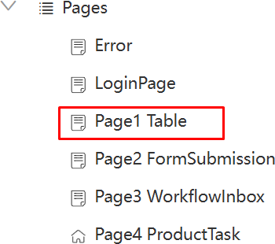
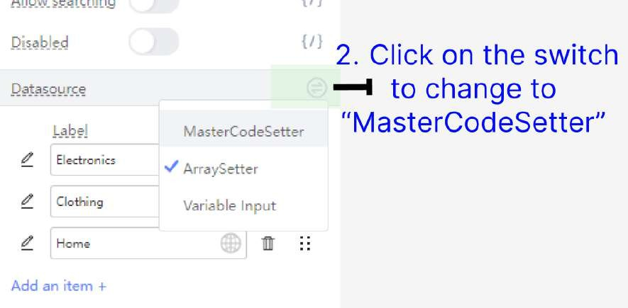
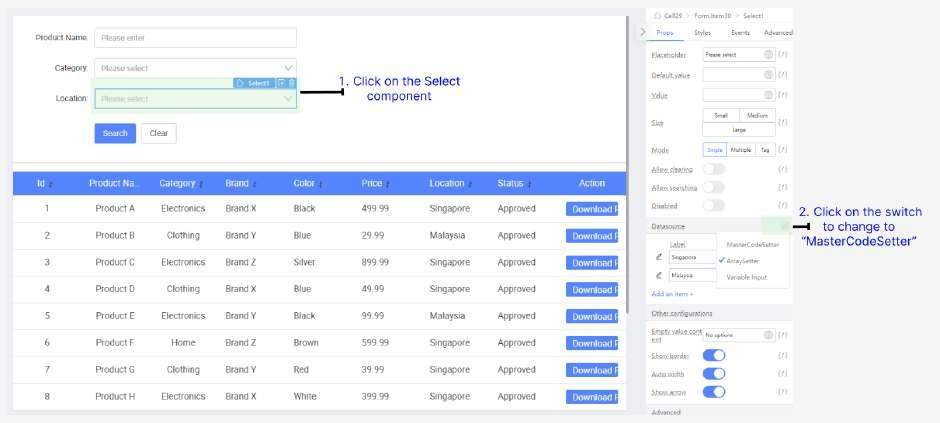
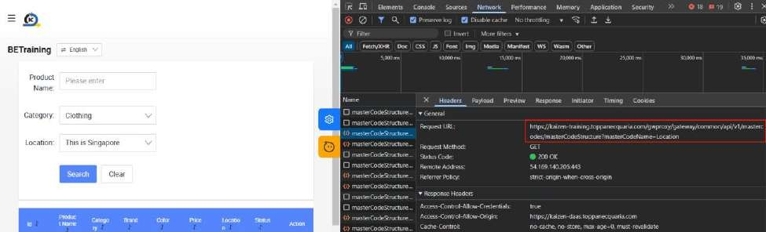

# Practical 15.1: Integrating Master Code

(Note) Two Master Codes “Category” and “Location” were already created

In App Designer, click on Page1 Table page

Click on Category search field

(Note) Notice that the current values for this dropdown are static and hardcoded under

Datasource section

Click on the switch icon to switch to MasterCodeSetter in order to dynamically populate this field

Select MasterCodeSetter

Note: MasterCodeSetter supports multiple components such as Select, Cascader, CascaderSelect, PhoneInput.

In the dropdown, select Category

Similarly,select Location form search field. Under Datasource, click on switch icon

and change to MasterCodeSetter

In the dropdown, select Location

Preview the page

Perform the Searching function. Note that it still works as intended using Master Code values fetched dynamically, instead of hardcoded values

