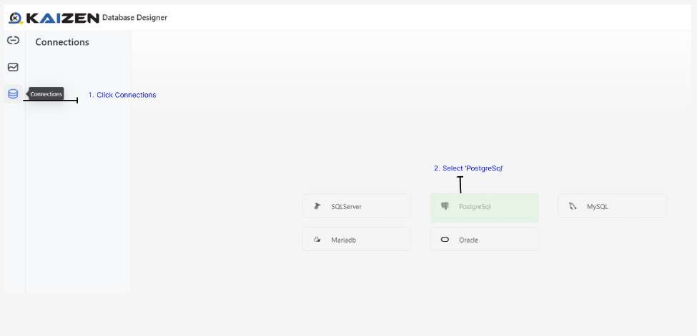

# Connect to the PostgreSQL Server

In the studio console, go to your project and click Database Designer to launch the user interface

Click Connections and select PostgreSQL

Enter the following configuration details:

Host: 172.20.0.141

Port: Use the default PostgreSQL port (usually 5432)

User: <username>

Password: tr@ining2025

Database: trg_single

Test the connection. Once successful, click on Save

