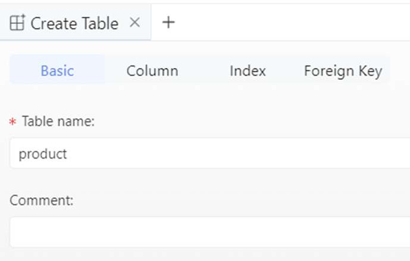
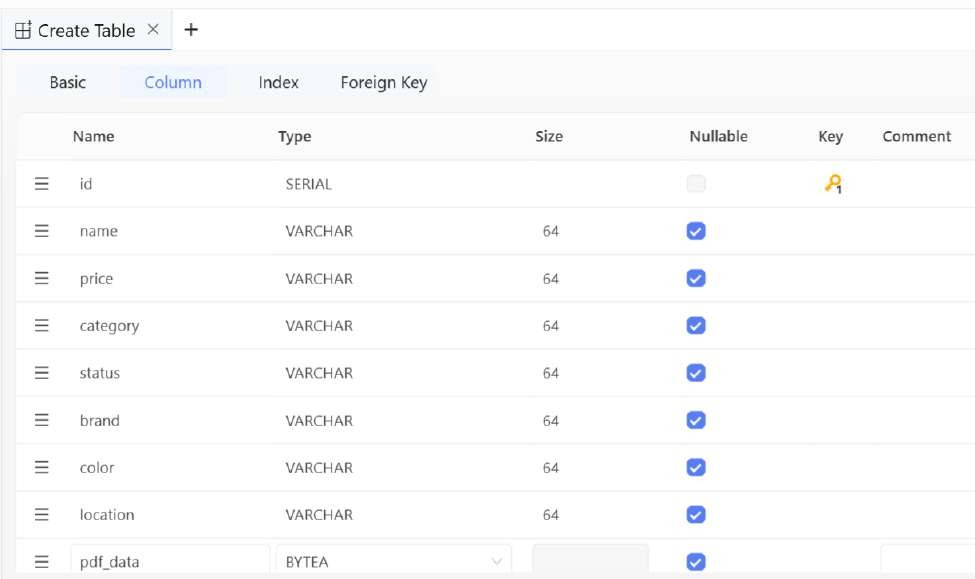
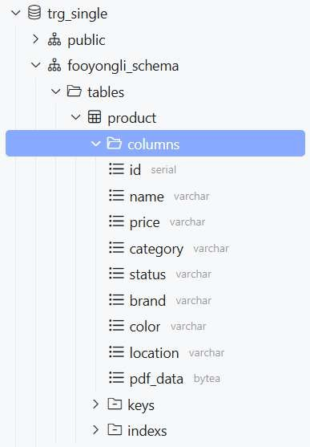

# Creating a New Table

To create a table, right-click on the Tables section under the created schema and select

Create Table.

In the right-panel section under Basic, enter the table name product

Under Column, click on Add column to add new columns

Define the following columns for the product table

Click Save

Click Run in SQL preview

CREATE TABLE "product" (

"id" SERIAL NOT NULL , "name" VARCHAR(64) NULL , "price" VARCHAR(64) NULL ,

"category" VARCHAR(64) NULL , "status" VARCHAR(64) NULL , "brand" VARCHAR(64) NULL , "color" VARCHAR(64) NULL ,

"location" VARCHAR(64) NULL , "pdf_data" BYTEA NULL , PRIMARY KEY ("id")

);

After creating the table, expand the Tables section under the schema to view the newly created table.

