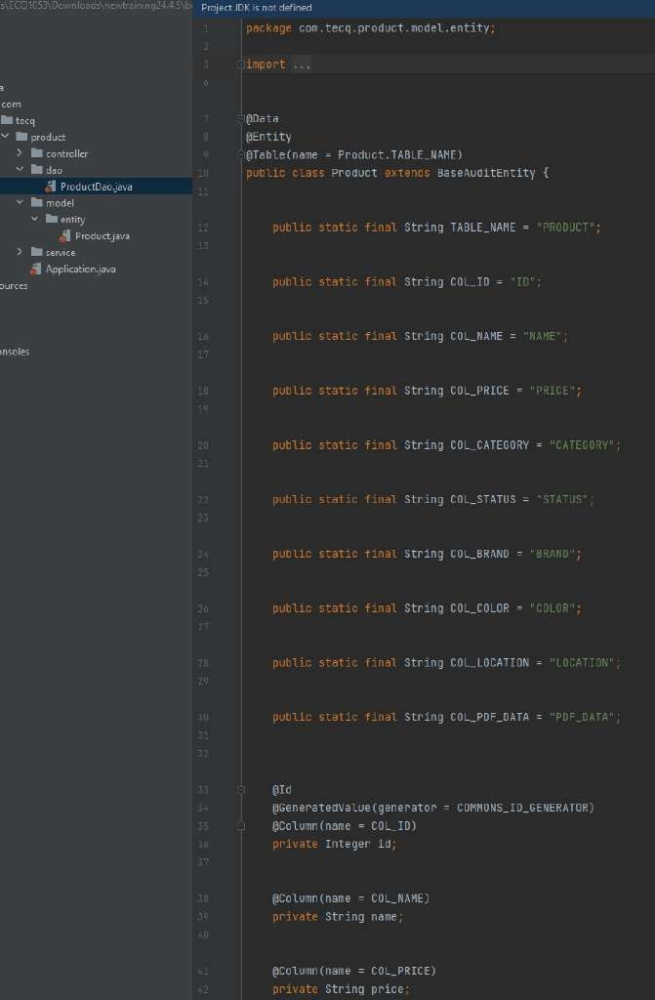

# Benefits of Database designer

The Database Designer tool supports automatic generation of Data Access Objects (DAO) during code generation. This feature allows developers to quickly generate Java classes that map to database tables and handle CRUD operations, reducing the need for manual coding. We will explore this feature in greater detail in later tutorials.

In addition, the Database Designer also supports the automated creation of Entity Relationship (ER) Diagram and Data Dictionary for your application’s Databases.

