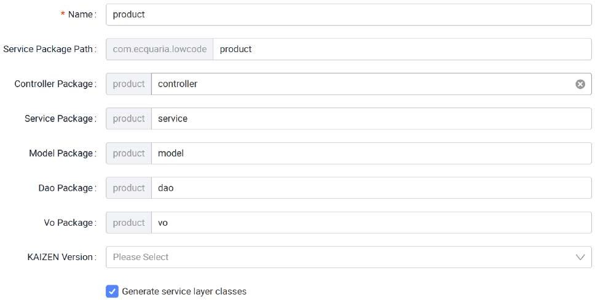
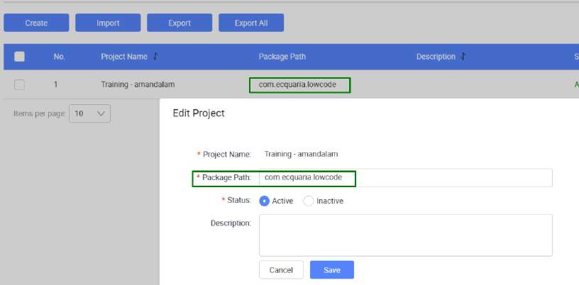

# Adding a Service

The Service API Designer allows you to create and manage service (microservices), which serve as the backbone of a modular application architecture. Microservices enable scalable and independent components for handling different application functions. Microservices offer flexibility in development by breaking down a monolithic application into smaller, independent services that can be developed, deployed, and scaled individually. This ensures that each microservice focuses on a specific business capability, allowing for faster updates, better fault isolation, and easier scaling.

In Tutorial 11, you would have already added an empty ‘Product’ microservice in order to

initialize your Git Repository. Click on it in the Service API Designer to edit the service.

In the configuration panel, name your microservice to represent its function (e.g.,

"Product” for Product microservice").

Name: Product

This is the name of the service being created. In this case, "Product" represents a microservice responsible for managing product-related functionalities in your application.

(1st level) Package Path: com.ecquaria.lowcode

This specifies the root path at project level. Only project admin has the privilege to edit this value.

(2nd level) Service Package Path: product

This specifies the base package path where all service-related components will reside. It organizes the project structure under product, ensuring that the service logic is well-organized.

(3rd level) Controller Package: controller (Default value: controller)

The package where the controllers will be placed. Controllers handle incoming HTTP requests and route them to the appropriate service methods, providing endpoints for the API.

(3rd level) Service Package: service (Default value: service)

This defines the location for service classes. The service layer contains business logic that performs operations related to the domain (e.g., product management), sitting between the controller and DAO layers.

(3rd level) Model Package: model (Default value: model)

This package holds the data models or entities representing your domain objects. In this case, the Product model would define the structure of product data in the system.

(3rd level) Dao Package: dao (Default value: dao)

DAO (Data Access Object) package contains classes that interact with the database, executing queries and managing persistence for your models (e.g., fetching or saving product data).

(3rd level) Dao Package: vo (Default value: vo)

VO (Value Object) package represents a simple object that holds data and defines an attribute or a concept in the domain.

Priority: 0

The priority defines the importance or order of this service relative to others. A lower number (like 0) could indicate higher priority, ensuring this service is loaded or accessed first when needed.

Example of generated code structure based on the value entered:

Note the Package Path value is specified when creating the project and the value can be edited. Only project admin can edit this value. For this training, the value of com.ecquaria.lowcode is being used.

