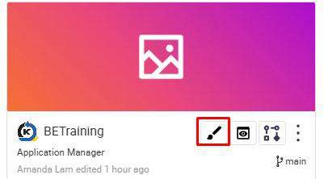
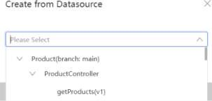
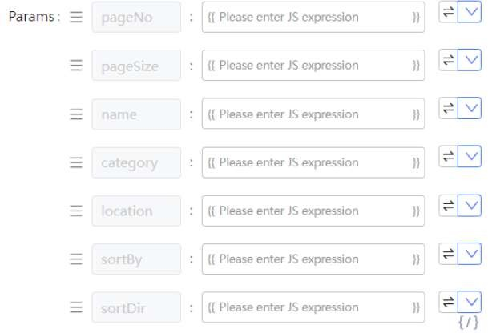
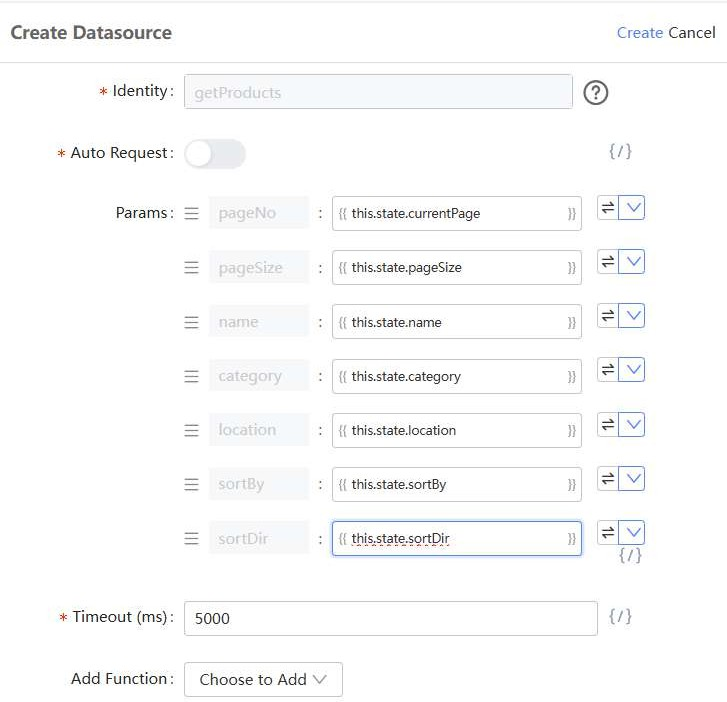
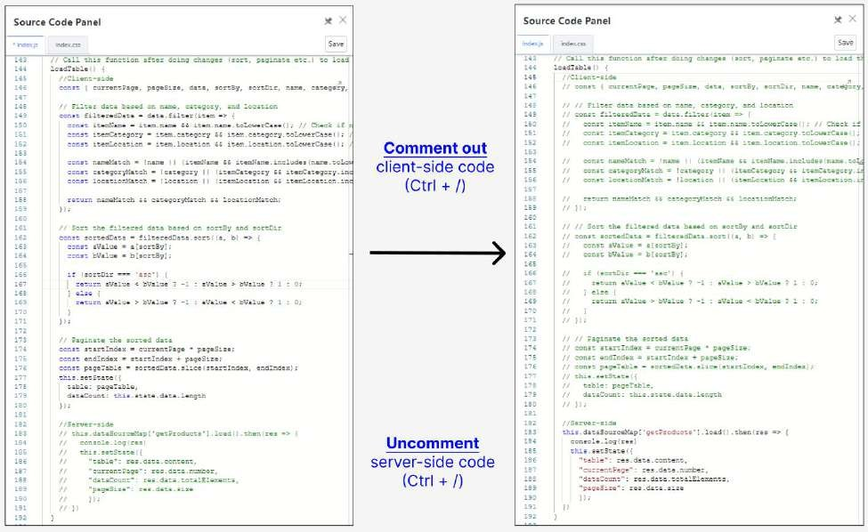

# Practical 19.1: Binding API to Table (GET)

Binding an API to a frontend design enables seamless interaction between the user interface and backend services. This process allows developers to easily connect UI components to RESTful APIs, facilitating real-time data retrieval and manipulation with minimal coding. KAIZEN uses intuitive drag-and-drop interfaces, making it accessible for users with varying technical skills. This approach accelerates development, enhances maintainability, and allows teams to focus on business logic and user experience, leading to quicker deployment and improved application quality.

Navigate to the App Designer page by clicking on the Design icon

Go to Page1 Table page by clicking on the Resource panel

Click Preview  to enter the preview page, click Confirm using default roles

Explore the client-side feature (Searching, Sorting, Pagination)

Select Datasource and click Create

In the pop-up window, select getProducts and click Next

In the datasource configuration panel, click the V icon and select Expression

It will change the text box to javascript expression, allowing values to be evaluated dynamically

Ensure all other fields are changed to Expression

Enter the following details for the datasource configuration and click Create:

Locate the loadTable() function in Source Code Panel

Comment out Client-side code and Uncomment Server-side code and click Save

Shortcut key: Ctrl + /

Preview the page and observe Sorting, Searching and Pagination function are all server-side now

Inspect “Network tab” in developer tools to see that server side requests are

firing (F12)

