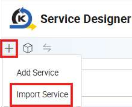

# Import Remaining APIs

In the Service Designer, click on ‘Import Service’ to import in the remaining 3 APIs

required for the BETraining application with the following file: kaizen-service(cleaned).xml

