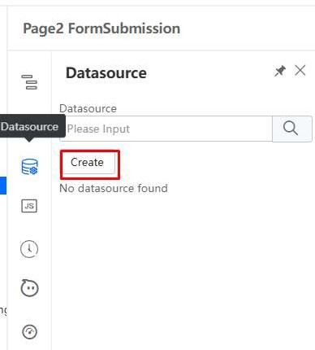
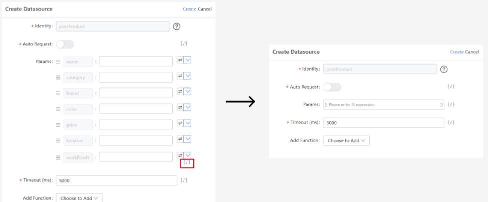
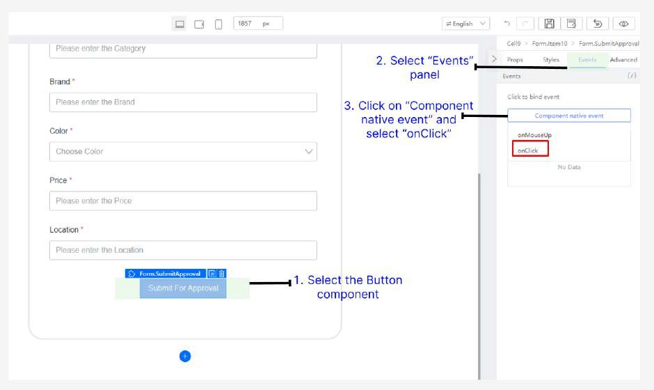
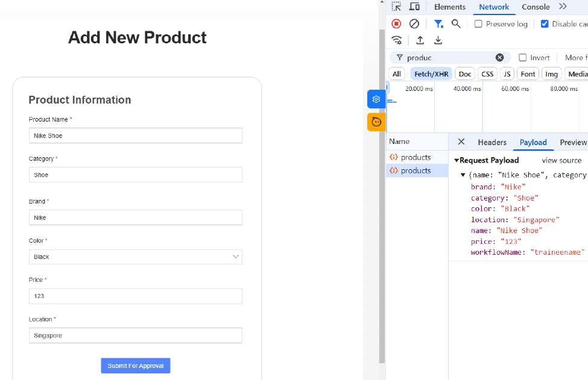

# Binding to FormSubmission

Go back to the App Designer and navigate to the Page2 FormSubmission page

Select Datasource and click Create

In the pop-up window, select postProduct and click Next

In the datasource configuration panel, click the slash-icon (/) icon to change to javascript expression.

*Note: This configuration simplifies the process by reducing redundancy, as you can handle multiple values with a single expression, rather than configuring each parameter individually.

Enter the values:

Params: this.state.productForm

Click Create

Next, Bind Button component to onClick event

Select onSubmit and click Confirm

Make sure to publish these changes made and click Preview to enter the preview page (which will also automatically publish for you)

Open “Network tab” via developer tools to inspect the request being sent to server

The request payload name is set from the Form.Item Advanced property

