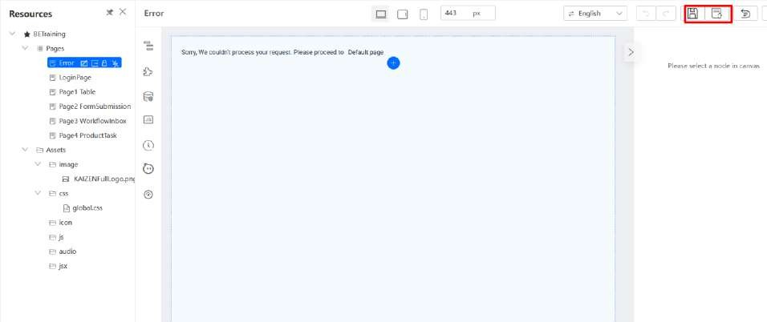

# Practical 20.1: Redirect to custom error page

Click on Edit Application

(Note) View the Error Pages configuration:

Forward Error: Error will be forwarded to page

To Error Page: Error will be redirected to error page

Navigate to the Error page, click on Save Draft and Publish Page

We will go through this error handling effect in a later tutorial on Code Generation to showcase how pages will be redirected to custom error pages.

