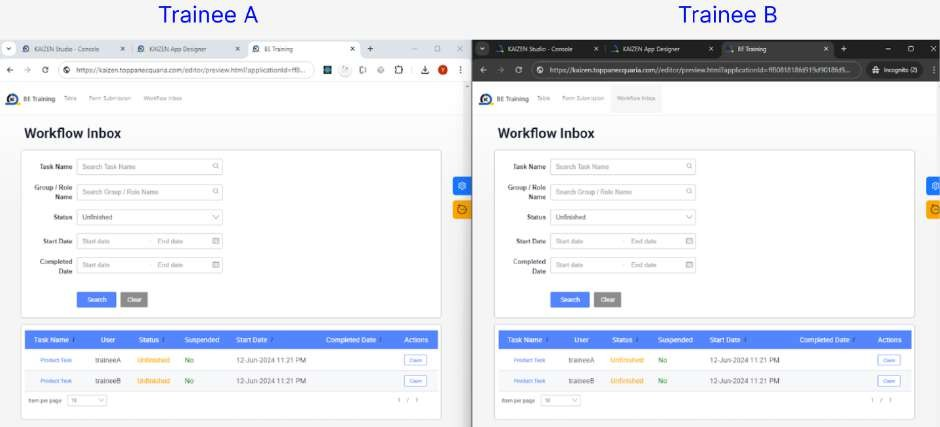
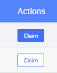
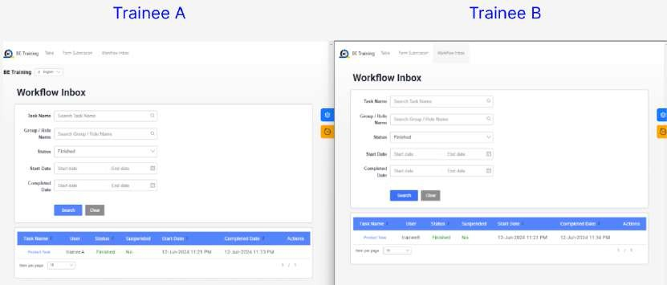

# Practical 21.1: Using default workflow (Claim-based routing)

The backend APIs have been integrated with some of the workflow APIs, enabling smooth communication and data exchange between the application's backend system and the workflow management platform.

Task Claiming: When a task becomes available within the workflow, it is open for claiming by any eligible participant or user.

Claim Ownership: The participant who claims the task takes ownership and responsibility for its completion.

Task Completion: Once claimed, the participant is expected to complete the task within a specified timeframe or according to predefined criteria.

Navigate to the “Workflow Inbox” page

Task Claiming: When a task becomes available within the workflow, it is open for claiming by any eligible participant or user. Hence, all users can see the task for any user.

Under “Actions” column, each user claim their own task by clicking on the “Claim” button

Claim Ownership: The participant who claims the task takes ownership and responsibility for its completion.

After claiming their own task, each user is now able to see only his/her own task.

Task Completion: Once claimed, the participant is expected to complete the task within a specified timeframe or according to predefined criteria.

Click on Approve/Reject button to complete the task

According to the workflow, the task can either go through ‘Approval' or ‘Rejection’ flow.

Click on either Approve or Reject

In the workflow inbox, each user can see their own completed workflow by filtering status

‘Finished’

