# Practical 21.2: Designing and Deploying custom workflow

This exercise involves designing and deploying a custom workflow by creating a sequence of automated steps to improve a business process. You'll start by analyzing the requirements, then design the workflow with tasks, conditions, and decision points. Next, implement the workflow by writing code or configuring a workflow tool.

Click on the “Workflow” icon

Import the workflow

BETraining_Workflow.bpmn

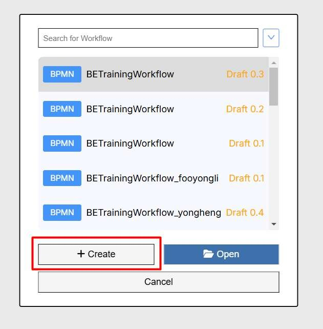

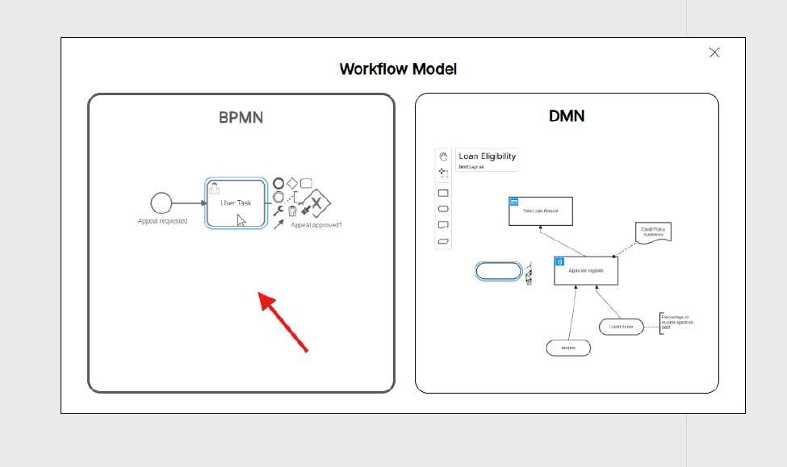

Disclaimer: For this training , we will focus more on the BPMN workflow.

Import the downloaded workflow and press Create button.

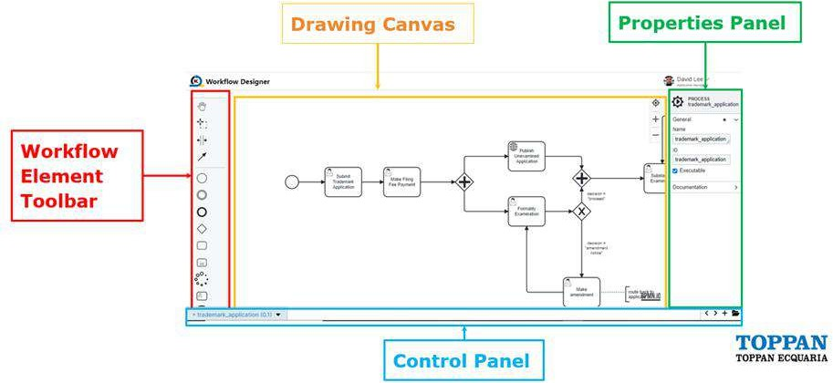

Disclaimer: Above is the sample description of workflow element, not representing the imported workflow.

KAIZEN Workflow Task Elements

In the imported workflow, rename it by changing the Process name to your username

<username>

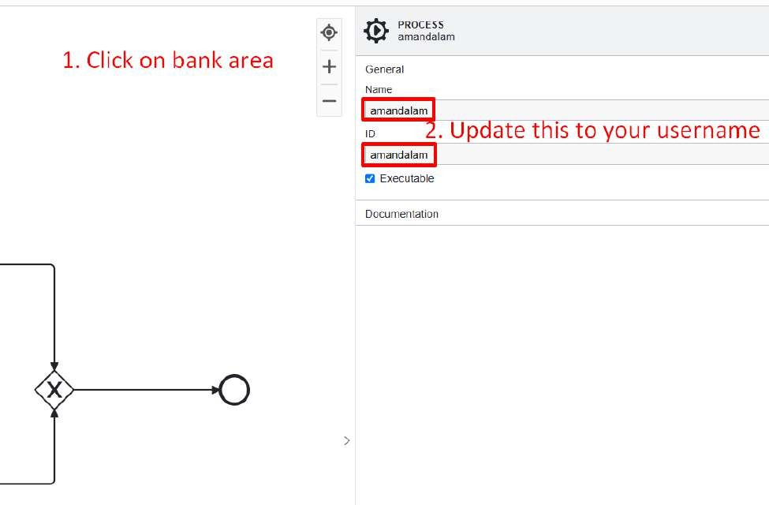

Save the workflow

Start designing the workflow

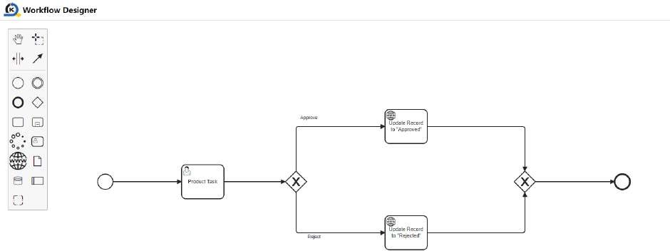

We will be using the following two tasks for this training:

JDBC Task: involves connecting to a database using Java Database Connectivity (JDBC) to execute SQL queries and manage database operations. This task allows for reading, updating, and manipulating database records within a workflow, ensuring data consistency and enabling dynamic data-driven processes.

Javascript Task: involves writing and executing JavaScript code within a workflow to perform custom operations. This task can include data manipulation, making API calls, handling conditional logic, and other dynamic behaviors, allowing for flexibility and control over workflow execution.

Drag the JDBC task beside the HTTP Task

Remove the original HTTP Task

Update the JDBC task with the following values:

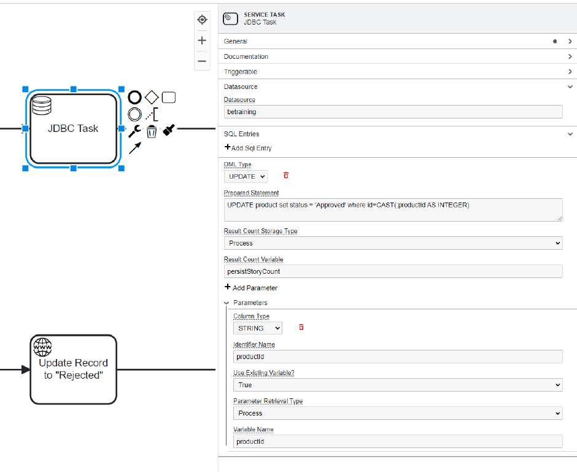

The JDBC task is trying to update the database directly by setting the status to ‘Approved’. This database is the training central database that you have connected to via the Training Environment Profile earlier (the Profile feature will be explained in further details in Tutorial 23). The workflow feature is running on the central db so all trainees can see Approved and Rejected tasks.

Drag the Javascript Task to the workflow

Update the Javascript task with the following javascript code:

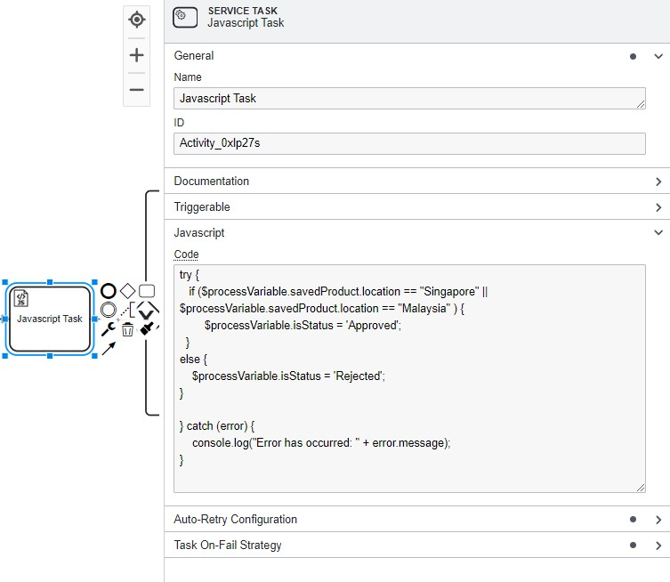

This Javascript task ensures that the location must be ‘Singapore’ or ‘Malaysia’, else it will change the ‘isStatus’ to ‘Rejected’ and takes the Reject flow instead

try {

if ($processVariable.savedProduct.location == "Singapore" ||

$processVariable.savedProduct.location == "Malaysia" ) {

$processVariable.isStatus = 'Approved';

}

else {

$processVariable.isStatus = 'Rejected';

}

} catch (error) {

console.log("Error has occurred: " + error.message);

}

Your complete workflow look like this

Export your workflow

Login to Training Environment (https://kaizen-training.toppanecquaria.com/#/login)

Username (Example: yongheng)

Password (Password$1234)

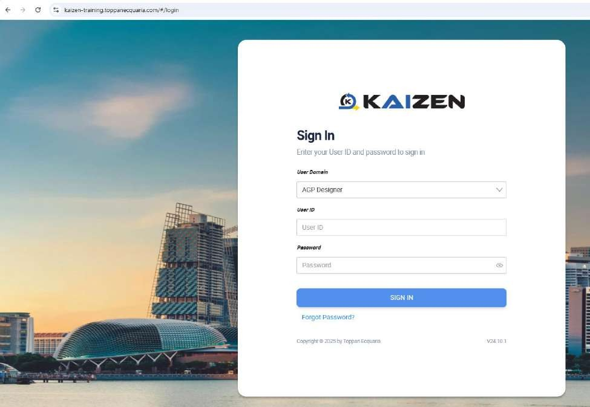

Navigate to Workflow Admin

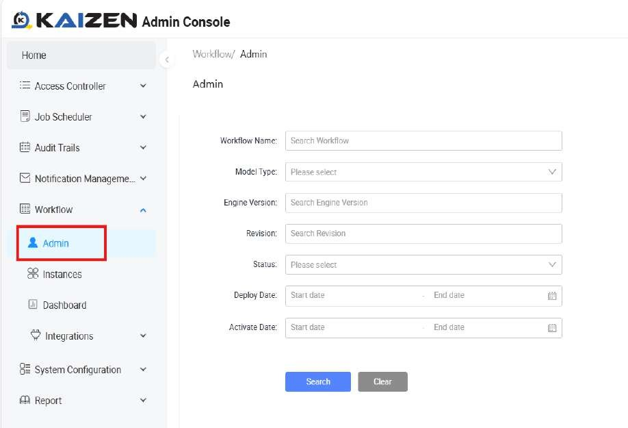

Deploy the workflow

To use your workflow, frontend code logic needs to be modified.

Navigate to BE-Training App

Make Sure Training Profile is selected and configured as below

na

Under the Source Code Panel of the FormSubmission page, edit and replace the value with your username

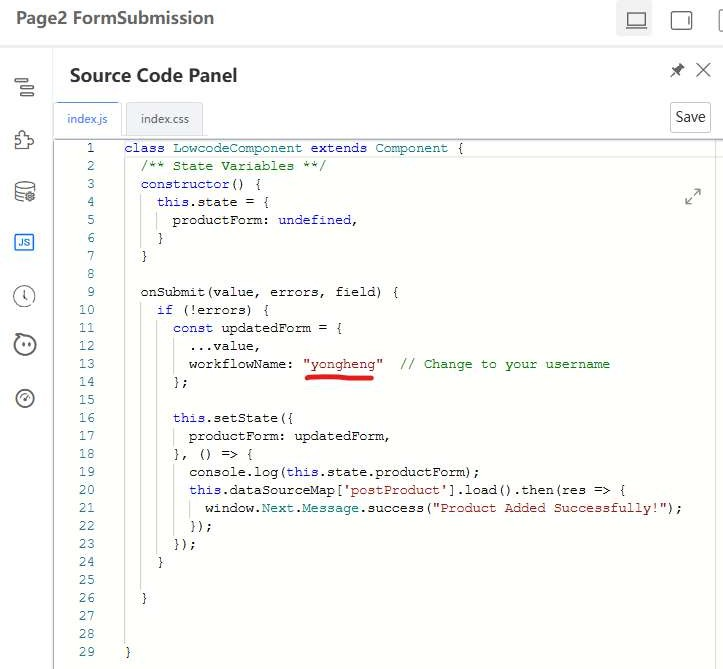

Submit a form to trigger user task

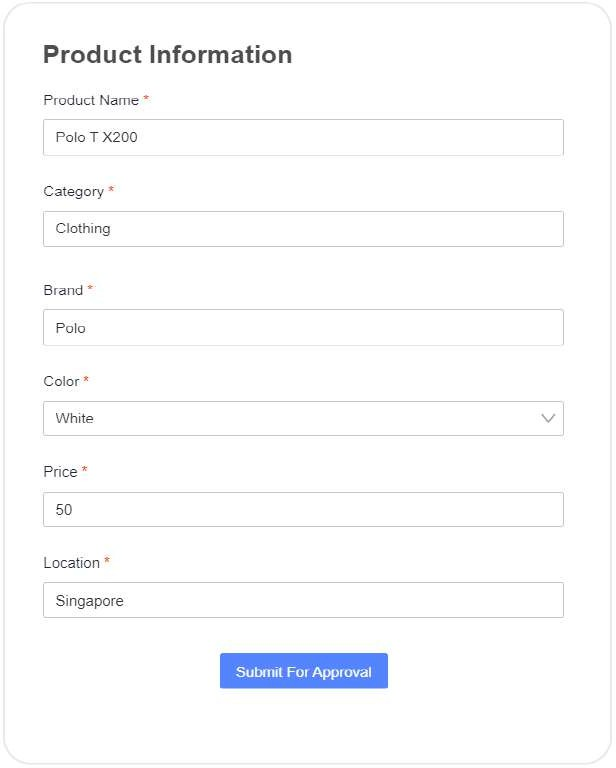

From the admin page, a new workflow instance was started.

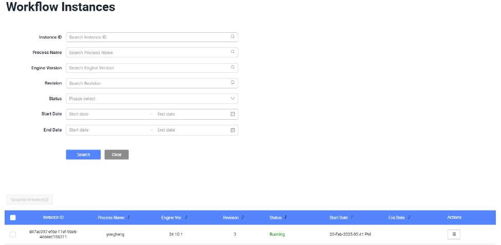

Open workflow inbox to claim and Reject the task that was submitted

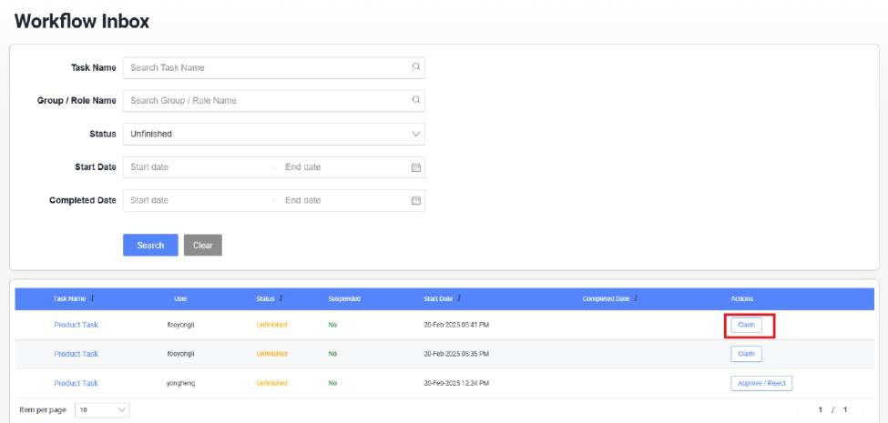

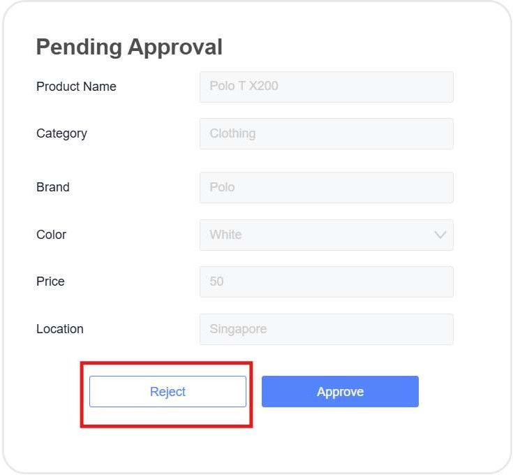

After rejecting the task , the workflow instance has been completed as shown below.

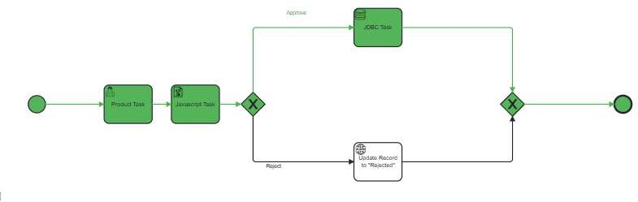

But why does it goes to “Approved” flow?

Previously we have added a javascript task to do location check in javascript in here.Thus if the location of product task was “Singapore” or “Malaysia”, the status will set to Approved”

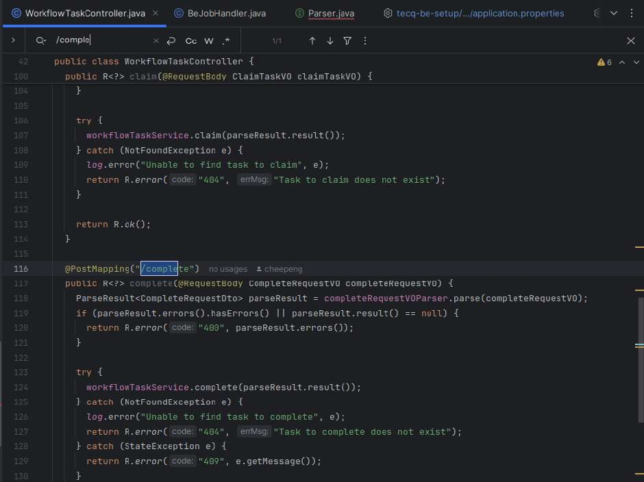

