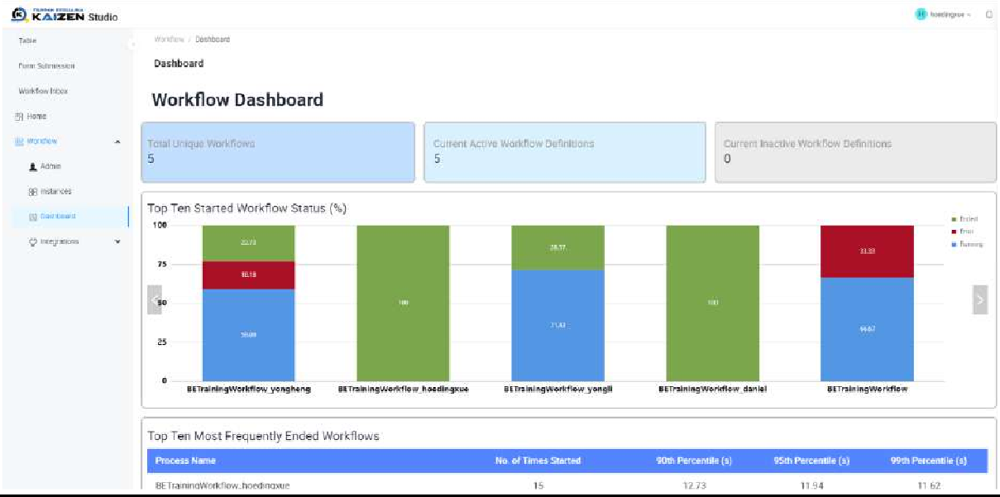
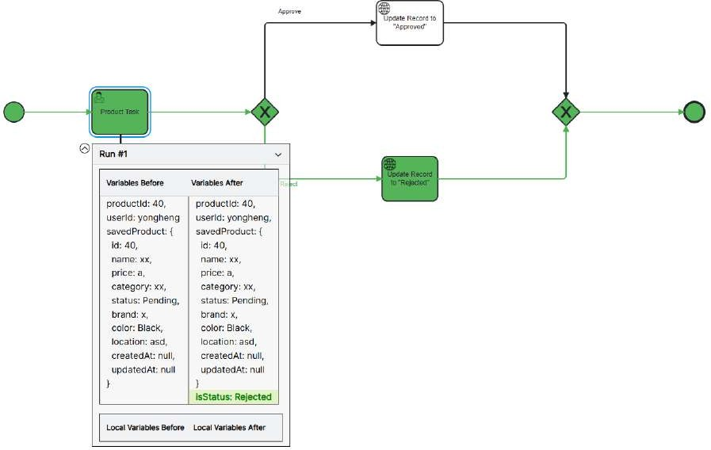
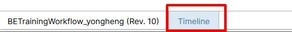

# Practical 21.3: Workflow observability

In this practical 4.3, we will look into workflow observability features.

Workflow Dashboard

Workflow Instance Tracking

Workflow Execution Timeline View

Workflow Dashboard

Dashboard allows users to gain overview of workflow running and status

Workflow Instance Tracking

Track and monitor the live execution of your workflows visually with color-coded indicators for easy identification, allowing you to spot workflow issues at a glance. Instance variable and allows users to zoom in on specific tasks for quick diagnosis and resolution, by looking into the variables comparison passed between each workflow task. This will be useful in observing the variable transfer and changes in the workflow.

Workflow Admin can also monitor the status of each workflow instances

For example, the two instances were the one created earlier

Click on “View Instance”

By clicking on the page, we can view the instance variable values before and after the workflow task.

Workflow Execution Timeline View

The timeline feature allows users to look into the time execution of each workflow task. This is useful in observing any bottlenecks and deep dive into individual tasks for debugging in the event of error.

We can also click on the ‘Timeline’ tab

We can see the time execution of the task

