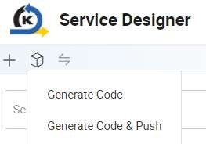
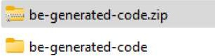

# Generate Code

In Service Designer, select Generate Code

Ensure Backend: Product is selected together with the Generate service layer classes option, and click OK

A zip file is downloaded

Unzip the file

