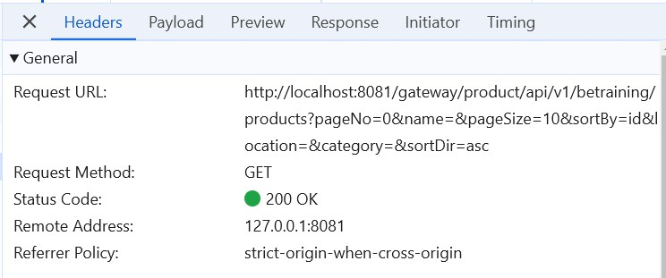

# Practical 23.2: Update Profile feature

Click “Profiles” plugin

Add a new “localhost” profile

Click on Test Connection to test connectivity

Select “Use by viewer”. Selecting this feature will ensure that the application’s users with

external or internal viewer roles will use this profile when previewing the application.

Click to switch the profile

Click OK to reload the site

Ensure a Tick sign appears on the localhost profile

Refresh the page, note that API calls are made using your configured profile “localhost”,

which allows users to do local development.

Notice that all these data loaded on your application’s ‘Page1 Table’ page are taking the data

you have added in your schema earlier using the Database Designer Tutorial.

