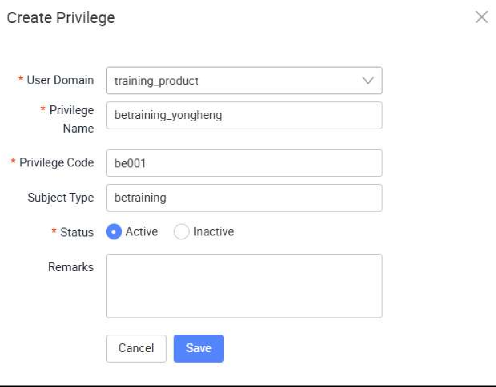
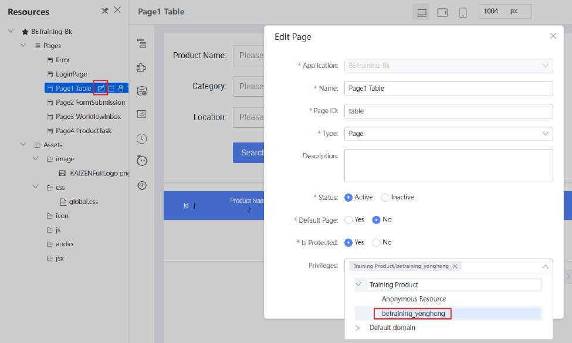

# Tutorial 24: Customize Privilege for Page Permission

This tutorial covers the following Learning Objectives:

Understand the Importance of Page Permissions in securing application pages and controlling user access.

Learn to Define Custom Page Privileges and configure custom privileges for specific application pages to grant access.

Now that you are able to get your application successfully running on your local profile, you can easily develop and test the integration between your backend code logic and your frontend application screens. However, the concern with your current application is that any user will be able to access all pages in your application. In this tutorial, you’ll explore how you can configure your pages with custom privileges to control its access privileges. We will go into more detail about all the other Identity and Access Management (IAM) features in the last tutorial.

Click on setting and select Privileges

Click Create to open a popup

Enter the following value:

User Domain: training_product

Privilege Name: betraining_<username> (example: betraining_yongheng)

Privilege Code: be001

Subject Type: betraining

Click Save

Edit each page to add in the necessary privileges

The above configuration of privileges for the respective pages mean that only users with roles that have the corresponding privilege would be able to access the respective page in the application. This step will ensure that your local application would be able to run smoothly after the next tutorial on code generation for backend.

More details on the other IAM features will be covered in the last tutorial.

