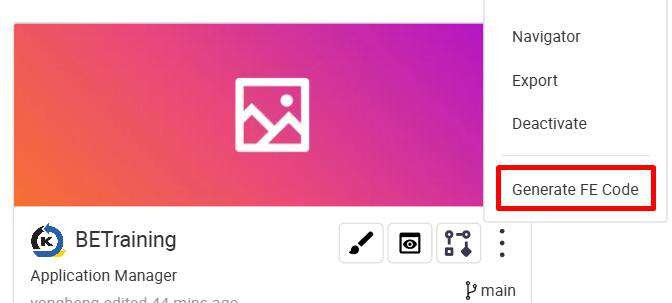
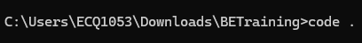
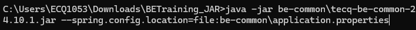

# Generate Code

Click setting and select Generate FE Code

A zip file is downloaded

Unzip the file

Open with your code editor or using command prompt

Visual Studio Code

Command Prompt

Ensure you’re using node version of 18.20.4

node -v

Change yarn registry path as some custom dependencies are hosted internally in Toppan network nexus

Install yarn (Skip this step if you’ve already installed yarn)

npm install -g yarn

yarn config set registry http://alb-kaizen-daasez-001-673358367.ap- southeast-1.elb.amazonaws.com:8081/repository/npm-group

Install the dependencies

yarn install

Run the application

yarn run start

