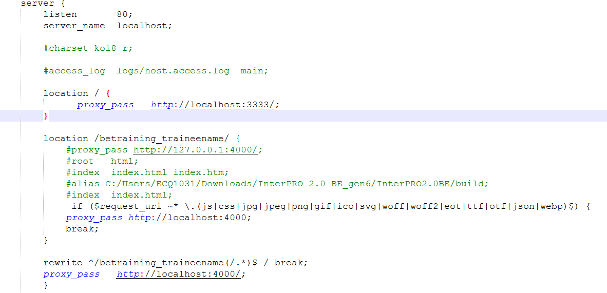
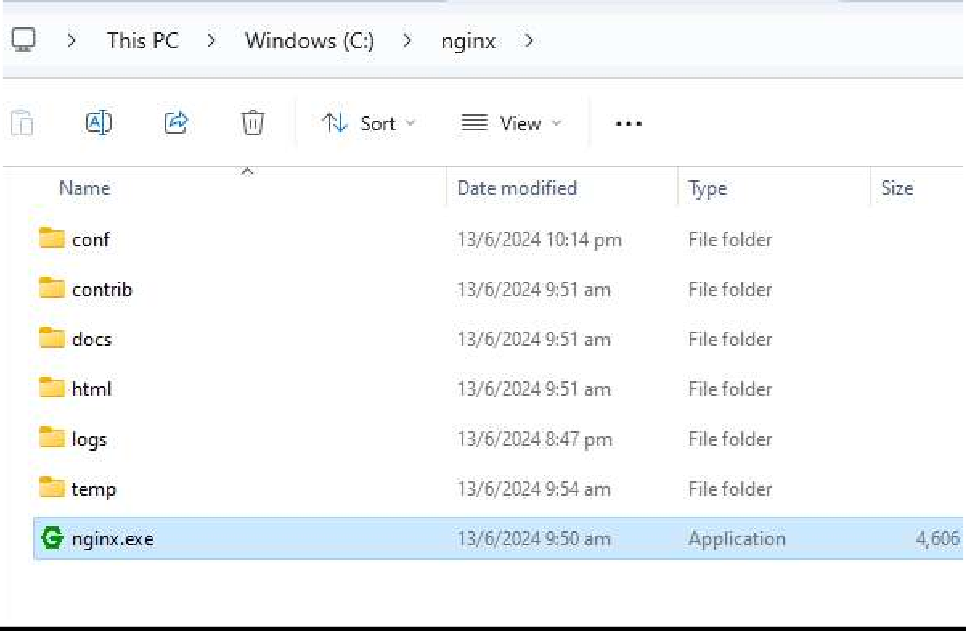

# Running nginx

Edit the nginx/nginx.conf value in the nginx folder to your username

betraining_traineename (Example: betraining_amandalam)

New nginx conf

For macOS:

Copy paste nginx.conf file inside /opt/homebrew/etc/nginx folder

Double click the nginx.exe to start the service. Some helpful command for debugging:

start nginx

nginx.exe -s stop

tasklist /FI "IMAGENAME eq nginx.exe"

For macOS:

sudo nginx

sudo nginx -s stop

