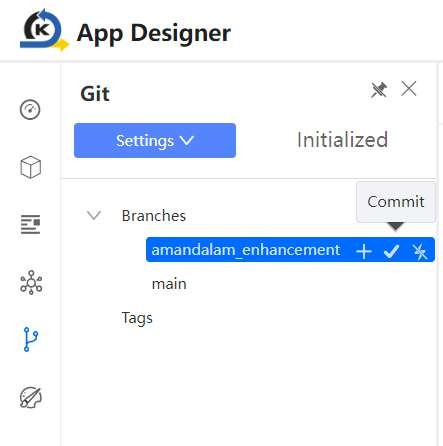
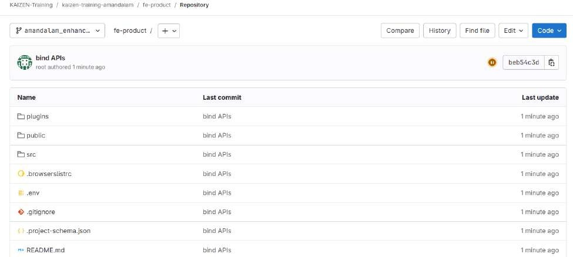
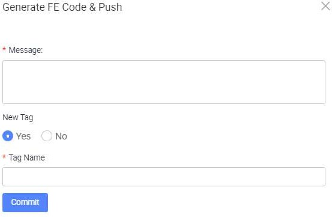

# Create New Tag and Git Push

On the App Designer, click on the commit icon of the branch you are on and proceed to commit changes, which will generate the FE code and push into Git.

When the branch is ready to be released, as you push your code to Git, you may also tag your commit to mark a specific commit as a release version (e.g., v1.0, v2.1.3) and is immutable.

You should be able to see this code changes pushed onto the branch on Git as well.

Another way to push FE Code onto the current branch on Git is from the project itself on the studio console by clicking Generate FE Code & Push.

