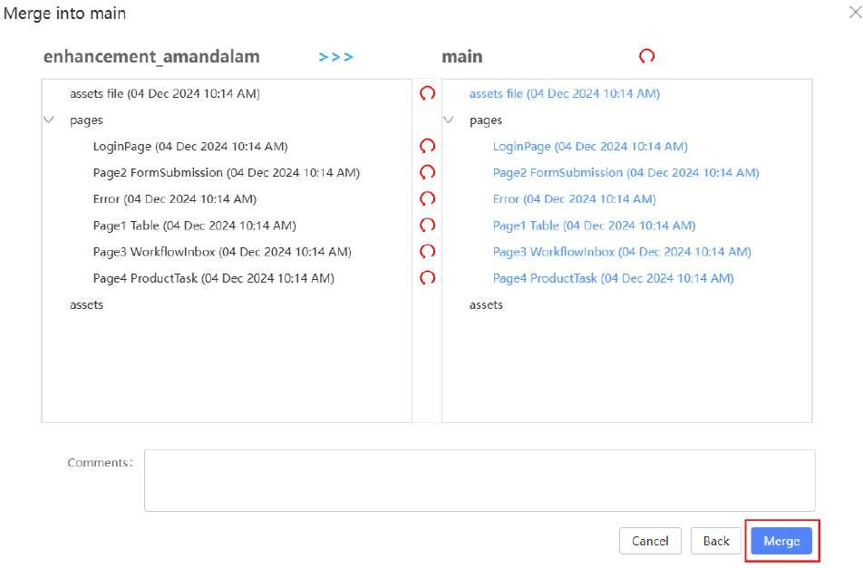
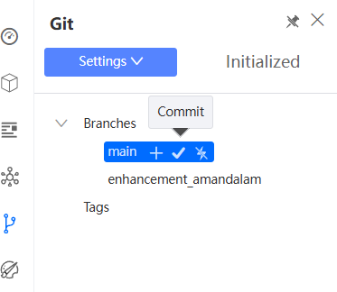

# Merge Code to Main Branch + Push Main Branch

Once you are done making relevant enhancements on your current enhancement branch, we will now proceed to merge your FE changes to the main branch.

Switch back to the main branch by clicking the Git branch on your application from the studio console.

In your app designer, click on the merge button beside the application and select your enhancement branch to merge into the main branch.

Before you merge, notice that the new additions will be highlighted in green. You will need to specify what you want to merge in by clicking on the blue arrows at each individual addition or on top to merge in all new additions.

In this case, the red colour coded indication indicates that there are changes to existing lines in the code. You may click into the file icon of each of the pages to view the

changes.

Click on the blue arrow on top to merge in all new changes made by the theme change.

After which, click on the ‘merge’ button.

You may now verify that your enhancements have been successfully merged and reflected on your application screens on the main branch.

Note that KAIZEN’s merge feature is not a replica of merging on Git. Refer to the

additional information below for more information on KAIZEN’s Git features.

Next, we will proceed to push these changes on the main branch onto Git. As done in the earlier step, click on the commit icon of the branch you are on and proceed to commit changes, which will generate the FE code and push into Git.

Once again, you may verify these code changes pushed onto the main branch on Git as well.

