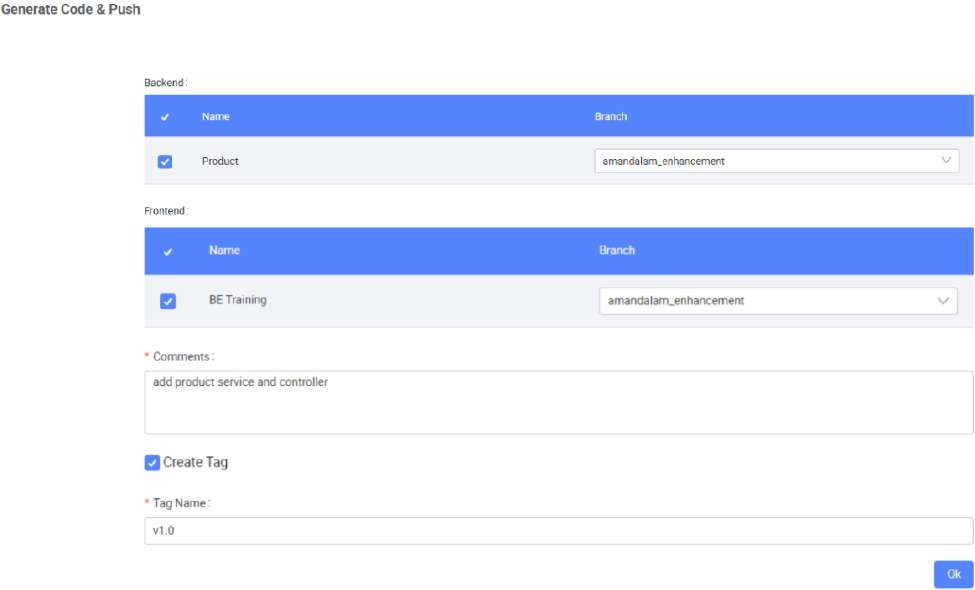

# Create New Tag and Git Push

Earlier you have configured your respective service and controller in the Service Designer. Now we will proceed to generate the BE code and push these changes onto this new branch.

This will successfully push both the FE and BE code onto the specified branch on Git.

Similar to FE code push, notice that we can also create a tag for the BE code that we want to push to allow us to manage releases for features built.

