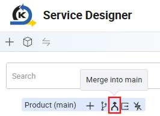

# Merge Code to Main Branch + Push Main Branch

Once you are done making relevant enhancements on your current enhancement branch, we will now proceed to merge your BE changes to the main branch as well. Switch back to the main branch.

Click on this merge button to merge into the main branch.

Select the new branch you pushed your code to earlier to merge into the main branch.

Before you merge, notice that the new additions will be highlighted in green. You will need to specify what you want to merge in by clicking on the blue arrows at each

individual addition or on top to merge in all new additions. After which, click on the

‘merge’ button.

Notice that your main branch on KAIZEN’s Service Designer now has the newly merged

new datasource from the enhancement branch.

Next, we will proceed to push these changes on the main branch onto Git. As done in the earlier step, click on the commit icon of the branch you are on and proceed to commit changes, which will generate the BE code and push into Git.

You may verify these code changes pushed onto the main branch on Git as well.

