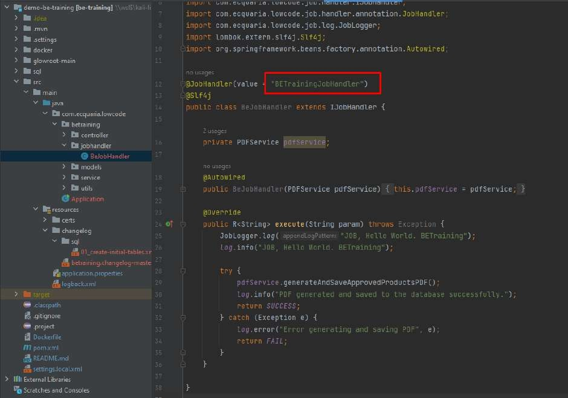

# Tutorial 27: Job Scheduler

This tutorial covers the following Learning Objectives:

Understand how to set up and configure a job scheduler within your application.

Learn to automate tasks at predefined intervals to improve efficiency.

Manage task execution to ensure the smooth operation of automated processes.

In this tutorial, you will learn how to configure a job scheduler within your application. The job scheduler allows you to automate tasks, enabling predefined processes to run at specific times or intervals. This feature helps manage routine tasks more efficiently, reducing manual effort and ensuring consistent operations.

A JobHandler function is already prepared for the training. We will go through a demonstration of how a Job can be created and used. The Job Scheduler is only accessible to an admin role.

