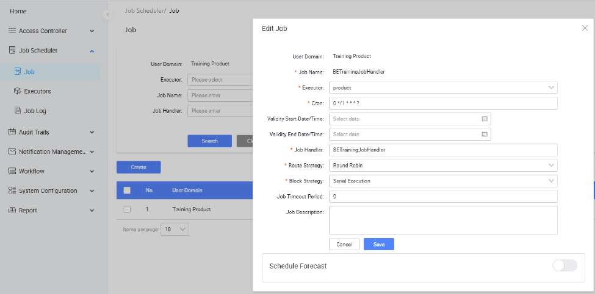
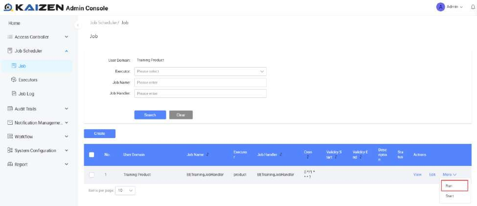
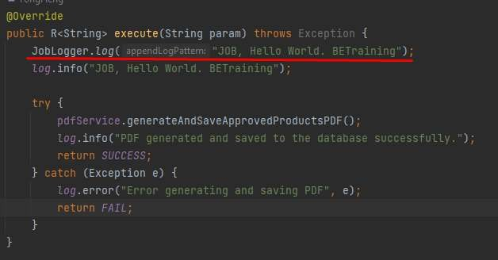
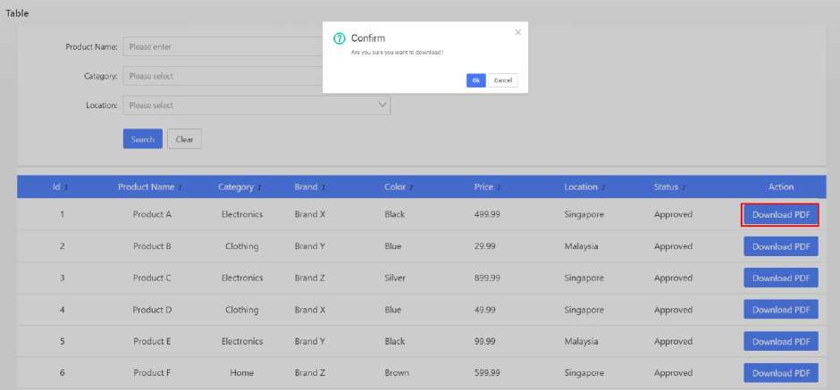

# Practical 27.1: Creating and Running Job (Demonstration)

The PDF generation of product listing has been configured to run via job scheduler. If we click the Download button, no file is downloaded because the job is not running.

As an admin, you can create a job scheduler via the “Create” button.

Endpoint assignment is also required for JobHandler to execute.

Run the Job function by clicking on the dropdown.

From the “Job Log”, note that we can view the job execution success or failure.

JobLogger function allows log to be written to the Job Scheduler log

JobLogger.log("JOB, Hello World. BETraining");

Back to our application, when we click the “Download” button, a PDF file is downloaded.

Note:

For custom service to appear in the dropdown, it needs to be added to the

“service.names.mesh” property in application.properties file.

Example:

application.properties file

...

...

service.names.mesh: '{"iam":{"host":"kaizen-trg-be-iam-service.kaizen- trg.svc.cluster.local","port":8082,"contextPath":"/iam"},"console":{"host":"kaizen- trg-be-console-service.kaizen- trg.svc.cluster.local","port":8083,"contextPath":"/console"},"common":{"host":"kaizen- trg-be-common-service.kaizen- trg.svc.cluster.local","port":8084,"contextPath":"/common"},"job":{"host":"kaizen-trg- be-job-service.kaizen- trg.svc.cluster.local","port":8085,"contextPath":"/job"},"gateway":{"host":"kaizen- trg-be-gateway-service.kaizen- trg.svc.cluster.local","port":8081,"contextPath":""},"pagescan":{"host":"kaizen-trg- be-lighthouse-scanner-service.kaizen- trg.svc.cluster.local","port":8086,"contextPath":""},"workflow":{"host":"kaizen-trg- be-workflow-engine-service.kaizen- trg.svc.cluster.local","port":8087,"contextPath":"/workflow"},"setup":{"host":"kaizen- trg-be-setup-service.kaizen- trg.svc.cluster.local","port":8089,"contextPath":"/setup"},"betraining":{"host":"kaize n-trg-be-training-service.kaizen- trg.svc.cluster.local","port":8092,"contextPath":"/betraining"},"iamproxy":{"host":"ka izen-trg-be-iam-proxy-service.kaizen- trg.svc.cluster.local","port":8091,"contextPath":"/iamproxy"}}'

...

...

