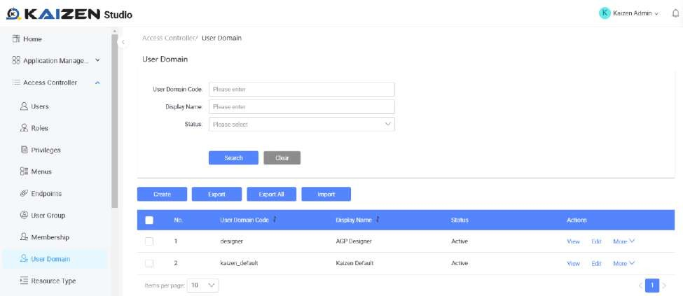
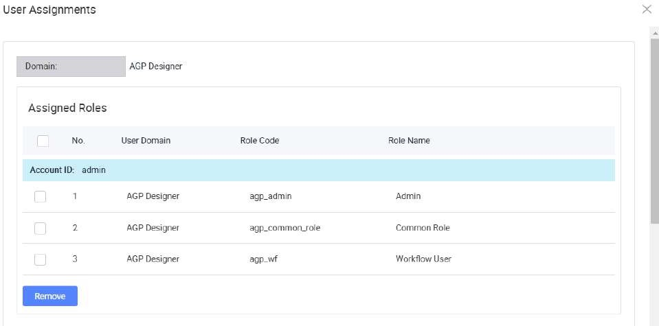
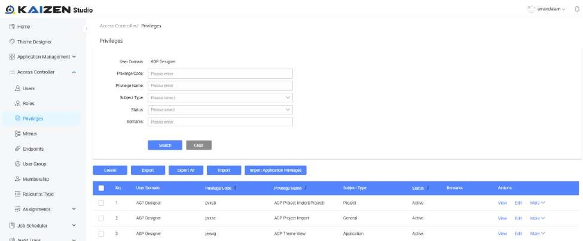
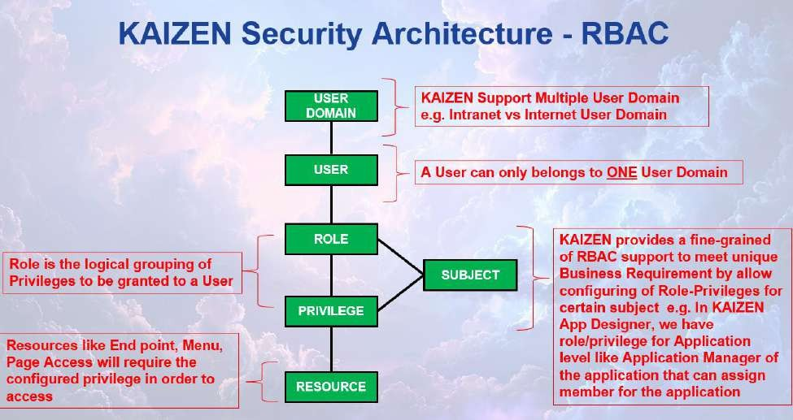

# Tutorial 28: IAM

This tutorial covers the following Learning Objectives:

Understand the concepts of IAM (Identity and Access Management) and Role-Based Access Control (RBAC).

Explore the relationships between user domains, users, roles, privileges, and endpoints.

Learn how to manage user roles, assign privileges, and secure access to endpoints in

an application’s domain environment.

In this tutorial, you will understand KAIZEN’s IAM system with RBAC, including defining user domains, assigning roles to users, configuring privileges, and managing access to endpoint resources securely and efficiently. This structure supports dynamic role and privilege assignments, allowing administrators to fine-tune access control. Privileges and resources ensure least-privilege access, aligning with security best practices. By leveraging this RBAC model, your application can provide efficient, scalable, and secure user access management tailored to organizational needs.

KAIZEN’s IAM features can be accessed here via the ‘Access Controller’ menu, which can be

accessed only if you have the admin role assigned to your user account.

Note that these are all actual runtime IAM features configurable for your application. In addition to this, KAIZEN also allows you to create your IAM configurations during the design phase of your application in the application level from the studio console.

You may access the admin user account in the Training Playground domain to access the IAM features.

URL: https://kaizen-training.toppanecquaria.com/#/login

User Domain: Training Playground

Username: admin

Password: Password$1234

Relationship: User domain ->* User ->* role ->* privileges ->* resources (API

endpoints/menu/page)

Example Flow

Currently there are 3 users in the "Sales" domain who are assigned to 3 roles:

“Manager”, "Editor" and "Viewer."

The Editor role has privileges to READ and UPDATE sales data endpoints.

The Viewer role has privileges to READ sales data endpoints.

The Manager gains combined access to CREATE,READ,UPDATE,DELETE sales data endpoints

User Domain

The User Domain acts as a boundary for user management and access control. It groups users, roles, privileges, and resources to enforce segregation of duties and multi-tenancy. Each domain defines its unique policies, ensuring users and roles within one domain do not conflict or overlap with those in another. For example, a project might have 2 applications, one being a customer facing portal (Internet) and the other being an internal staff portal (Intranet). In this case, the User Domain is introduced to maintain separation and enforce access control between the two user groups.

The user domain can only be accessed and configured by the ‘super admin’ role from the ‘Kaizen Default’ domain. You are also able to see this domain from KAIZEN’s login screen.

User

A User represents an individual entity with a unique identity within a specific domain.

Each user can belong to only one domain.

A user can be assigned one or more roles, depending on their responsibilities.

Users can inherit privileges indirectly through their assigned roles.

Role

A Role is a collection of privileges that represent a job function or responsibility within the domain.

Roles define what actions a user can perform by grouping privileges.

Users can have multiple roles, enabling flexible access control.

Roles are reusable and can be assigned to multiple users.

In a project scenario, our application offers some predefined roles that can be assigned to users, such as Project Manager, Developer, UI Designer, Internal Viewer, and External

Viewer. Each role is tailored with specific access levels, enabling precise control over features and functionalities for managing both applications and the overall project.

More information on Subject will be explained below.

Privileges

Privileges are granular permissions that define specific actions a role can perform on specific resources.

A role can have multiple privileges, specifying the allowed operations.

Privileges enforce fine-grained control over application features and functionalities.

Resources (Endpoints)

Resources refer to the endpoints or specific system assets that users can access. In our case, KAIZEN segregates access to various resources through endpoints.

Privileges are directly linked to resources, ensuring precise control over what each user or role can access.

Resources can include APIs, web pages, data objects, or any system element exposed through an endpoint.

Privileges define how resources are accessed, ensuring security and preventing unauthorized actions.

Subject adds a contextual layer to RBAC, by ensuring that roles and privileges apply only within a defined scope.

