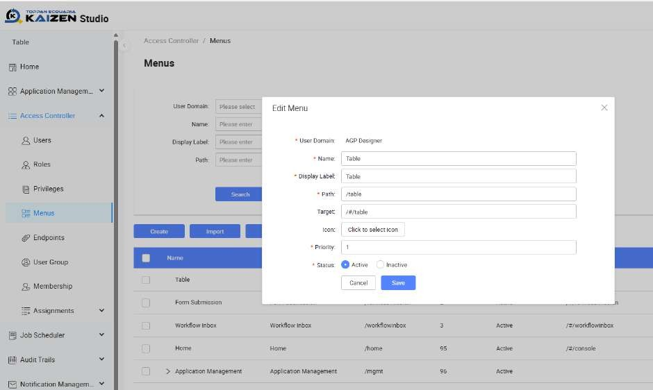

# Practical 28.1: Assignment of custom menu (Optional)

This tutorial covers the following Learning Objectives:

Learn how to assign custom menus and pages to your application.

Enhance navigation and user experience by providing tailored menus.

Understand how to structure your application to meet user needs more effectively.

In this tutorial, you will explore the process of assigning custom menus and pages to your application. This customization enables a personalized user experience, where navigation and page layout are adapted to meet the specific needs of your users or organization.

Create and Assign Menu

In the menu edit/create, you can fill in different fields such as name, label, path and target.

Menu also supports nested layer

Click on More > Assign

Users can assign custom privilege to allow only authorized users to view the menus

