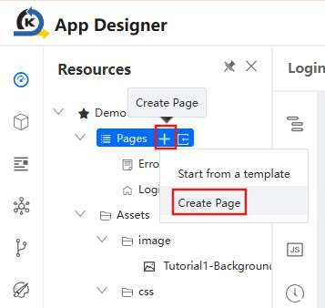
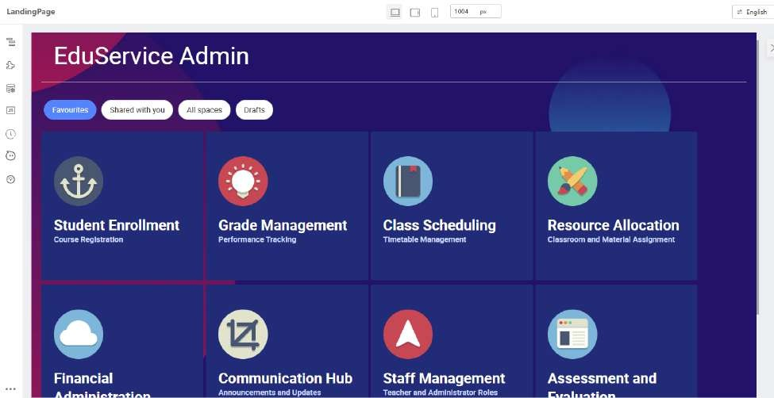

# Tutorial 2: Creating the Landing Page

This tutorial covers the following Learning Objectives:

Understand how to design and build an effective landing page using KAIZEN.

Learn how to structure the landing page to provide intuitive navigation and a welcoming user experience.

Explore how KAIZEN simplifies the process of customizing the landing page, including adding images, text, and buttons.

In this tutorial, we will walk you through the steps to design and build an effective landing page using KAIZEN. You'll learn how to structure the page to ensure intuitive navigation and create a welcoming user experience. Additionally, we’ll explore how KAIZEN makes customizing the landing page easy, allowing you to add images, text, and buttons seamlessly.

In order to create a new page, click on ‘Create Page’ of your application’s Pages and indicate

your page details accordingly before clicking Save.

## Practical 2.1: Create Initial Layout

Click Add Block Below (2 times) to add 2 more block

The expected result will be:

## Practical 2.2: Create heading

In the first top Cell, add a Text component

Set the properties and styles to

The expected result will be:

Add a Divider (in the first top Cell, below the ‘EduService Admin’ text)

Delete the text “Delimiter” from the Divider’s label

## Practical 2.3: Add Image Background to root page

Download image url: Tutorial2-Background.png

Upload the image asset in the resources panel

Select Page (you can do via either of the following):

Select Page from the Component Tree OR

Via the navigation above the Prop and Style tabs

Click on the image upload	icon

Select on the background uploaded earlier and click Confirm

Set the following styles

The resulting styles will be as follows:

The expected result will be:

## Practical 2.4: Add Button Group

In Component Library:

Search for “Button Group”

Drag into Block (second block as shown in screenshot below)

Set the Button Group with the following property

Select the first Button and set

Select the second Button and set

Click Duplicate (2 times) to duplicate 2 more buttons

Set the third button with the following property:

Set the fourth button with the following property:

The expected result will be:

## Practical 2.5: Create responsive card

In this practical, we will guide you through creating a simple, responsive card component. A responsive card adapts to different screen sizes, providing a clean and readable layout for your content on mobile, tablet, and desktop devices.

In Component Library:

Search for “Card”

Drag into Cell (Last cell shown in screenshot below)

Set the Card with the following

In Component Library:

Search the “Picture” component

Drag it into the Card component (Blue background as shown in screenshot below)

Set the Picture component with the following:

In Components Library:

Search for Box component

Drag a Box below the Picture component

Set the Box with the following:

Drag Text component (2 times) into the Box (illustrated below)

Set the first Text with the following:

Set the second Text with the following:

Download these 8 images from this folder: Tutorial2-images

Upload these images into asset in the resources panel

Download card-json-data.txt, edit all the image path to your app id as located here.

Edit the image path

E.g

/gateway/console/api/v1/asset/{yourapp-id}/assets/image/Anchor- icon.png?branchName=main

Select the Card component and navigate to Advanced (Top Right Corner) tab

Click on Bind data

In the pop-up, update the data with the following value (card-json-data.txt below):

The expected result will be:

Select Picture component by clicking on it

Under Image property, click on Switch Setter icon

In the dropdown, select Variable Input to bind data:

In the popup box, update the value “this.item.imageUrl” under Bind variables

Click Confirm to update the value

The expected result will be:

Select the Heading Textbox and click on Variable Binding

Set the following property

Select the sub-heading Textbox and set the following:

The expected result will be:

Click on the Container Area and ensure Cell is selected

Set the following properties

The expected result will be:

