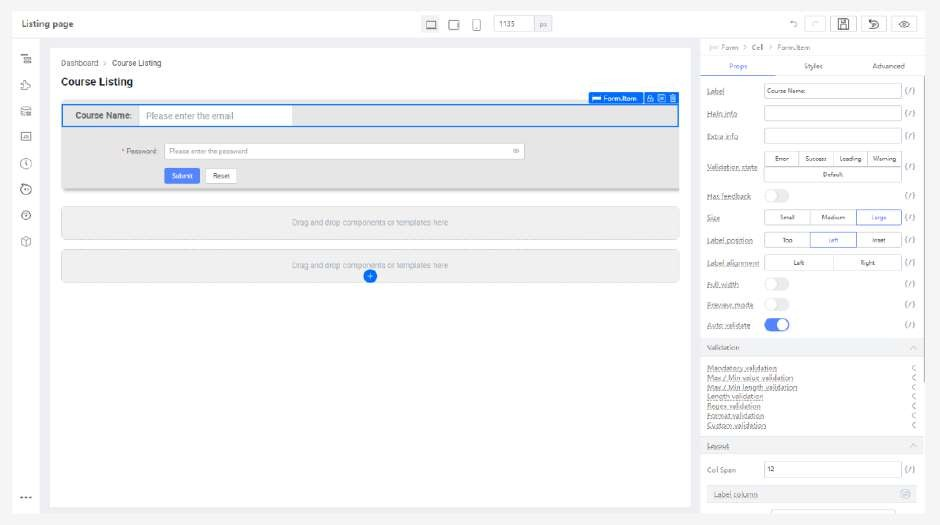
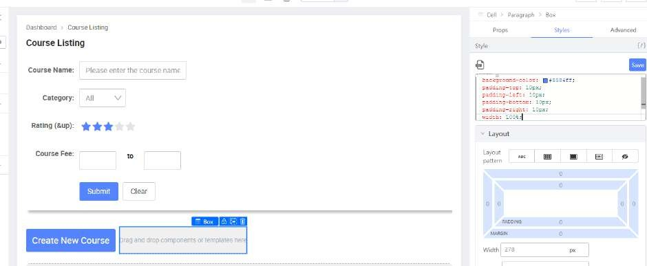

# Tutorial 3: Creating the Listing Page (Optional)

This tutorial covers the following Learning Objectives:

Understand how to design and implement a basic listing page using KAIZEN, utilizing the table component to display data effectively.

Learn how to structure and customize the table to organize and present information in a clear and user-friendly manner.

In this tutorial, we will guide you through the process of building a listing page using KAIZEN. By utilizing the table component, you will learn how to effectively display and organize data in a table. This tutorial emphasizes creating a user-friendly, dynamic listing page that allows users to view and interact with large sets of data efficiently.

## Practical 3.1: Create Initial Layout

Create a new page

Click “Add Block Below” 3 times to add 3 more blocks

The expected result will be:

## Practical 3.2: Create Heading and Breadcrumb

Select “Page Header” from “Component Library” and drag into the first block

Set the following

## Practical 3.3: Create Search form

Select the second Cell and set the following:

Select “Form Template” from “Component Library” and drag into the second “Cell”

Select the first “Form Item” by clicking on the label

In the first form item, set the following:

In the Input, set the following:

Remove the Password Form.Item

Remove the associated Cell

Click “Duplicate” 3 more times. Please take note to copy the Cell item, not the Form

item.

Remove the second “Input’”

Replace the Input with a “Select” component

Set the Form.Item and Select component to the following:

Delete Input and replace it with a rating component

Set the Form.Item and Rating component to the following:

Update Form.Item property and replace the fourth “Input” with a “3 Columns” component

In the “3 Columns” component, insert a “Number Input” to the first and third column. Delete the “Form Item” Label and set the Size to Large.

Add a “Text” component to the second column. Similarly, click on its “Form Item” parent

component and delete the Label.

Set the Text component to the following:

Set the Column (With Number Input) to the following

Set the Column (With text) to the following:

Set the Column (Last number input) to the following:

Click on last form.item (Containing area)

In the Form.Item (With Submit Button), set the following:

Props

Size: Large Wrapper Column

Span: 0

Offset: 3

Styles

margin-top : -10px;

Set the “Reset” button label with the following

## Practical 3.4: Create List header

Drag a “Button” to the third “Block”

Set the following

Drag a “Box” beside the Button

Set the Box with the following:

Drag a “Text” component into the “Box”

Set the Text with following:

## Practical 3.5: Create Table

Add “Table” to the last “Block”

In “Table” properties, set the following

The expected result will be:

In “Table” properties, under Data Column, set the following properties to all data

columns

Example with the “Age” Data Column:

Add a “Picture” to the table first column ‘Box’

Set the following styles

Add a “Box” to the first column beside Picture

Set the following styles

Add a “Text” to the “Box” from the previous step

Set the following to the “Text” component

Add a second “Text” to the “Box

Set the following for the second “Text”

Add another “Box” below the “Text” component

Set the following

Add a Rating component to the “Box” inserted in previous step

Add a “Text” beside Rating and set the following

Add another “Text” beside Rating and set the following

Add a “Card” to the second column

Set the Card with the following

The expected result will be:

Add a “Text” and set the following

Add a second Text and set the following

Add a Button to the last column

Set the following:

Edit the table datasource with the following json data:

listing-table-json.txt

Note: Remember to change the appID path on the courseImage

Upload these images to Asset->images: elearning-education-internet-lessons-online.jpg,data- analysis.jpeg, Teachable.png

In the Picture, select “Variable Input” in Switch Setter and set the following to bind

variable

The expected result will be:

Based on the numbers in the image below, variable bind these values to the following component in their Props tab:

The expected result will be:

