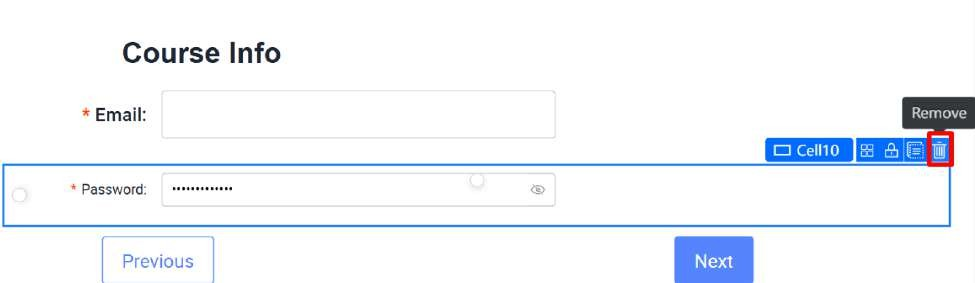
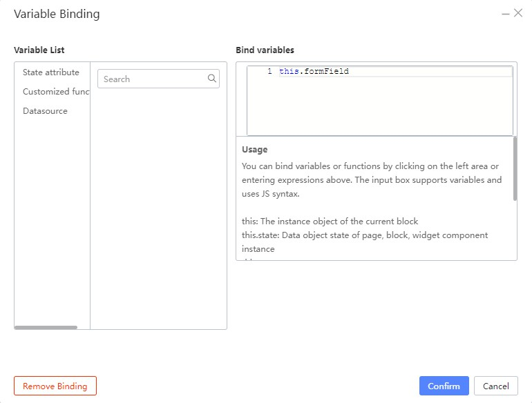
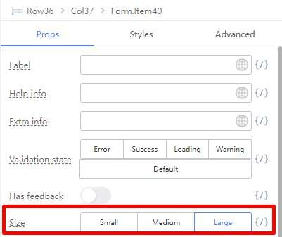
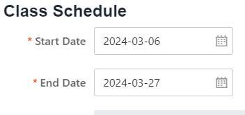
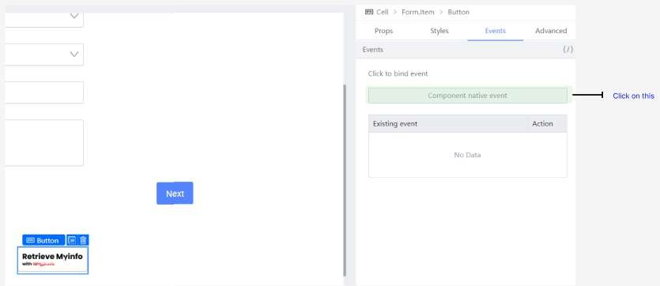

# Tutorial 4: Creating a Form with Steps

This tutorial covers the following Learning Objectives:

Understand how to design a multi-step form using KAIZEN.

Learn how to break down complex forms into manageable steps for a smoother user experience.

Explore how KAIZEN simplifies form creation by providing step-by-step navigation and validation between steps.

In this tutorial, you will learn how to design and build a multi-step form using KAIZEN. By breaking down a complex form into smaller, more manageable steps, you'll create a smoother and more engaging user experience. KAIZEN’s tools will guide you through adding step-by-step navigation, validation, and data handling, ensuring that users can easily complete the form without confusion.

There will be 4 Forms in total:

Course Info

Instructor Particulars

Class Location

and Class Schedule.

## Introduction: Form Fields

Forms are components that accept inputs from various Form fields and then, through user interaction (usually a button press), submit the field information from the form to the backend for processing.

Previously, we encountered forms in Tutorial 1. A refresher on what the form looked like:

As you can see, the form contains an Email Field, a Password Field and a Login Button.

The Email Field is known as an Input Field, which accepts open-ended values of text you type from the keyboard. The Password field is a special Input Field that does what the Email field does, but also masks the input so that others cannot see what is being typed on screen.

Finally, the Login button submits the values that the user keyed in for each field, possibly to an Authentication Server.

While this is sufficient for a Login Form, modern web languages also support a multitude of other form fields, like radio buttons, dropdown selects, date pickers and more. Fortunately, Kaizen supports a good number of these.

In order to access them in the Kaizen App Designer, you can go to the Component Library and search for them.

We will get to use them when we get to the practicals later on.

## Introduction: Form Validation

Validation (or Form Control) is a set of formatting rules defined for the browser to check. These validation rules usually act as an input format sanity check or as the first layer of defense against user-submitted dirty data, by allowing the browser to know when to warn and restrict the user before submission. The users are usually then allowed to change their inputs based on the warnings given by the browser.

You can see this in action, if you ever played around with the Login Form above, and tried to submit without any values typed into the form:

This is because the Form Template that is in App Designer’s Component Library has Mandatory Validation enabled by default for both its form fields. Mandatory Validation on means that the field in question has to have a value in it for the form to treat it as a valid submission.

Of course, Mandatory Validation is the simplest validation. There are other more complex validation types that might find more use in more complex form fields. In Kaizen’s App Designer, the Validations can be found in the Props tab for a Form.Item component.

## Practical 4.1: Setting up the Form

Creating the Form skeleton

Before the Tutorial begins, please do the following steps. This is to set up the form for the rest of the Practicals. Most of these should be familiar if you have done the Tutorials before, but still, try and closely follow the following steps:

Create a new Form Page.

Click on Add Block Below at the bottom.

Search for Steps component

Drag the Steps component to the top empty Cell.

Search for Form Template component

Drag the Form Template component to the bottom empty Cell.

Select Form component, under Properties (Props) of Form Component, set the following:

Search for Form Item component

Drag the Form Item component above the Email field.

Clear the Label field

Change the Wrapper column’s Offset to 3.

Drag a Text component to the top of the Form Template. Change the Styling and Properties of the text component to the following:

The expected output will be

Click on the Form Item containing area (as illustrated in the image below)

Change the Wrapper column’s Offset to 4.

Remove the Reset button

Click on the Form Item containing area

Ensure Cell is selected (Note you also see a white circle, which is a split cell icon)

Click the split cell icon to split the cell into two

Select the Form Item with the submit button on the left side and click Duplicate.

Drag the duplicated Form Item with the submit button to the right side.

The expected output will be:

Select the Form Item on the right (illustrated below)

Set the properties of Form Item to below

Select the Submit button

Under Properties Label, change Submit to Next.

You should expect to see something like this:

Style and configure the left button into a ‘Previous’ button.

Select the Form.Item. Under the Props tag, change Size to Large. Under Layout, change the Wrapper span to 14 and the offset to 5.

Select the Button. Under Content, change ‘Submit’ to ‘Previous’, Button Type to

Secondary.

And the button should look like this:

Select the Email Form Item Label by clicking on the label (illustrated below)

Change the Styling and Properties of the Email Form Item.

Select the Input component

Clear the Placeholder under properties

Select the Cell containing area (illustrated below)

Ensure the Cell is selected

Remove the Cell containing Password Form Item

Select the Form component (illustrated below)

Under the Props tab, click on the Field - Variable Binding (looks like this {/}).

Under the Bind variables text area, key in this.formField. We will go more into this variable later. For now, just click the Confirm button after typing it in.

Duplicate the Course Info Form 3 times. There should be 4 ‘Course Info’ Forms now.

Change the text in the bottom 3 Forms to ‘Instructor Particulars’, ‘Class Location’, ‘Class Schedule’ in order.

Change the Step sub-headers to their respective Step names:

Step 1: Course Info

Step 2: Instructor Particulars Step 3: Class Location

Step 4: Class Schedule

The expected output will be:

Form Setup Complete

The Source Code Panel

Let’s bring over the code we will be using for today’s tutorial to the Source Code Panel:

In the Kaizen App Designer, open the Source Code Panel on the left.

You should see the Source Code Panel appear on the left of the canvas:

Click on the gray button below to open a text file:

Tutorial4-Code.txt

Copy everything in this file to the Text Area in the Source Code Panel, like so:

Click the Save button on the top right of the Source Code Panel.

In this tutorial, the Source Code Panel will be used to handle some of the more complex logic for the forms not covered by the UI. If you are already familiar with JS and coding in general, you can skip to the next section (Practical 4.2).

Note that you will not be required to actually code. However, you will be required to do some uncommenting of the code. The following steps will guide you through the process:

Highlight a section of a commented code (text in green). A commented section of code will not be executed by the application. Essentially, it will be ignored.

Press Ctrl + / to uncomment the code.

There is an easy way to tell through the editor if the code is commented. If the text is

green, it is commented. If the text is not green, it is not commented. Make sure to save your changes.

## Practical 4.2: Form Fields and Form Validation

Context

The 1st Step: Course Info, is a form for filling in the basic Course information for students to refer to. By the end of this Practical, this is the form you will be creating:

Before we start: this Practical will only cover the ‘Course Info’ Form. Only work within this Form:

Objective

Learn about:

Creating a basic form

Mandatory, Length and Number Format validation

Basic Form Setup

Select the Email Form Item

Duplicate it 5 times. You should now have 6 Form Items in this form, like so:

Select the first Email Form Item and change the Label to Course Title.

Then, with the Form Item still selected, change the Name Property to courseTitle

Now, perform the same steps for each of the next 5 Form Items but with the following info instead

After entering the info, the form should now look something like this:

Ctrl + Click the Enrollment Type, Subject Type and Description Input Components.

Press the Delete/Backspace key to delete them.

The expected output will be:

In the Component Library, search the Select component

Drag the Select Component to the now-empty Enrollment Type and Subject Type

Form Item.

Ctrl + Click both Select components and In the Styles tab, change their width to 100%.

Click on the Enrollment Type Select Component. Under the Props tab, change the 3 Labels under Datasource to:

Part-time

Full-time

Online/Remote

Click on the Subject Type Select Component. Under the Props tab, change the Labels under Datasource to:

Accounting

Business

Computing

Design

Education

Click the pencil icon 🖉 beside Design and Education. Fill in the values for Design

and Education to 4 and 5 respectively.

Click on the Input Component in Course Fee

Add a $ sign in Text before field

From the Component Library, drag a TextArea Component to the now-empty Description Form Item.

Course Info Form Validation

Select the Course Code Form Item. Under Props > Validation, click on Length Validation.

Set the Length to 4.

Under Props > Validation, click on Format Validation.

Click on the Number Button (This ensures Course Code can only of type number)

Select the Course Fee Form Item

Set the Course Fee Form Item Validation. Format Validation: Number

Under Mandatory Validation

Turn off ‘Description’ Form Item Mandatory Validation.

Form Completion

Once you are done with everything, the first form should look like this:

## Practical 4.3: Create the ‘Instructor Particulars’ Form

Context

The 2nd Step: Instructor Particulars, is a form for filling in the Instructor Personal Particulars for the system to record and verify.

Before we start: this Practical will only cover the ‘Instructor Particulars’ Form. Only work within

this Form:

Objective

Draw the page in the above figure using the concepts that you learnt in: Form Fields and Form Validation.

Requirements

Hints

For this exercise, there is no need to do complex regex validations. Click and look through all the Validations - you might find what you are looking for inside.

Do not forget your Property Names in the Form.Items!

Expected Result

## Practical 4.4: ‘Class Location’ Form

Context

The 3rd Step: Class Location, is a form for filling in the Address where the classes for the course will take place.

Before we start: this Practical will only cover the ‘Class Location’ Form. Only work within this Form:

Objective

Learn about:

Creating 2 fields in one Form Item

Validation of both fields individually

Using Regular Expression Validation

Conditional Form Fields

Requirements

Note that for the highlighted part in yellow in the table, you should just have the Floor / Unit No. Form field ready. You will be taught how to create the 2 inputs in the next section.

For now, with the info above, you should have something like this:

Creating a Field with 2 inputs

Sometimes you will need to create a form field with 2 fields. The example we used in this scenario is a floor/unit no (eg #02-16) field.

Here is the revised table with the Floor and Unit No. separate.

It is possible to handle this in the Designer by using the 2 Columns or 3 Columns Component.

Remove the Input component within the Floor / Unit No. Form Item.

Drag a 3 Columns Component to the Floor / Unit No Form Item.

Drag a Form Item Component each for the left and right columns. Drag a Text Component into the Center column.

Drag Input Components into the left and right Form Items.

Ctrl + Click to select both Form Item Components.

Change their Styles to Large.

Select the left Form Item. Clear its Label and change its Property Name to floorNo Select the right Form Item. Clear its Label and change its Property Name to unitNo

Delete the Label of the center Form Item component

Styling for the Inputs

Ctrl + Select both Input Components. Delete their Placeholders. In Styles, change their

width to 80px.

Change the center Text Component to be a Dash (ie. ‘-’). Change Font Size to h4.

Select the Row Component inside the Floor / Unit No Form.Item.

Change the width of the row to 200px.

Select the Center Column Component.

Add a left padding of about 35px. The dash should be roughly aligned with the input boxes like this:

Validation for both input fields

Select the left Form Item and add Mandatory and Number Validation.

Select the right Form Item and add Mandatory and Regex Validation with this value:

/^\d{2,3}[A-Z]?$/

Add an Error message for this Regex Validation with this value:

unitNo is 2-3 digits + optional A-Z

Go into preview mode and click Next to see that both fields are now being validated correctly.

4.4.8 Form Completion

The final form should look something like this:

## Practical 4.5: Class Schedule Form

Context

The 4th Step: Class Schedule, is a form for filling in the start and end date which the classes will take place and also the schedule every week for this date period.

Before we start: this Practical will only cover the ‘Class Schedule’ Form. Only work within this

Form:

Objective

Learn about:

Custom Validation for the DatePicker to ensure Start Date is always after End Date

Doing a simple dynamic row adder

Requirements

For the Weekly Schedule:

Each schedule contains the Day of the week, Start Time and End Time.

The user must be able to create new rows representing a new schedule.

Custom Date Validation

Open the Source Code Panel and uncomment lines 7 - 8.

Uncomment the section under (lines 39 - 57). Then click the Save button.

Select the Start Date Form Item. Variable Bind the validation state to

this.state.startError

Select the End Date Form Item. Variable Bind the validation state to

this.state.endError

Ctrl + Click to select both the Form Items of Start Date and End Date.

Go to the Props tab, and click on Custom validation. Then, click on the Bind Function

button.

Under Select event, click on Event, then click on checkDates. You should get something like this before clicking on the Confirm button:

Go to Preview and check if the validation is working as intended by selecting the dates for both datepickers and deliberately choosing invalid values.

Creating the Form field that can add new Rows

Delete the DatePicker component under Weekly Schedule field

Remove the Mandatory Validation

Drag a Table Component to the Weekly Schedule Form Item.

Select the Table Component. Under the Props tab,

Turn off pagination.

Remove the ‘Add’ and ‘Edit’ entries in the Action Bar.

Remove the ‘Edit’ and ‘Preserve’ entries in the Action Column.

Add another Cell below the Weekly Schedule Table Form Item.

Then, drag a Button Component into it.

In the Props Tab for the button’s Form Item, change the following

Clear its Label

Size: Large

Wrapper Column offset to 4 so that it aligns with the table.

Change the button’s text to Add Schedule.

Add a + icon to the button

Select the Table Component again. Change the Data Columns to ‘Day’, ‘Start Time’ and ‘End Time’.

Edit each column by clicking on the pen icon on the left of each label. Change the Data Keys of Day, Start Time and End Time to ‘day’, ‘start’ and ‘end’ respectively. Set all their Data Types to ‘None’.

Repeat the above steps for Start Time and End Time

Drag a Select Component into the Date Column. Drag a Timepicker Component into the Start Time and End Time Columns.

Select one of the Select Components in the Day Column and add the following Options

Monday’, ‘Tuesday’, ‘Wednesday’, ‘Thursday’, ‘Friday’, ‘Saturday’ and ‘Sunday’.

Select the Timepickers in the Start Time and End Time columns. Under the Props tab,

Set the Format to HH:mm

In the Styles tab, set the width of the Timepickers to 150px.

Open the Source Code Panel and uncomment lines 9 - 13.

Uncomment the section under /** 4.5.5 **/ (lines 61 - 69). Then click the Save button.

Select the Weekly Schedule Table Component. Click on Variable Binding in Data Source.

Click on State Attribute under Variable List, then click on weekly. Then click the

Confirm button.

Click on the Add Schedule button. Go to the Events tab, and click on the ‘Component native event’ button.

Select the onClick event from the dropdown.

Under ‘Select event’, click on Event, then click on onClick_AddSchedule. Then Click the Confirm button.

You can now add extra schedules!

Form Completion

Your finished Form 4 should look like this:

## Practical 4.6: Cascade Dropdown

Context

Recall the 1st form, Course Info. There were 2 Select dropdown fields in that form:

Enrollment Type - which is values like Part-time, Full-time and Online/Remote.

Subject Type - The subject of the course (eg. Business, Computing etc.)

Now, let’s say there was a change in requirements: the Part-time, Full-time and Online/Remote courses can only have certain subject types. What we will need to do is to implement some conditional logic to handle that.

Requirements

In the 1st Form, Course Info,

The Select dropdown from Enrollment Type should populate a different set of values of Subject Type:

Adding the Logic

Open the Source Code Panel and uncomment lines 14 - 25.

Uncomment the section under /** 4.6.3 **/ (lines 76 - 81). Then click the Save button.

Click on the Select Component of the Enrollment Type Form Item. In the Events tab, click on the Component native event button and then click onChange from the dropdown.

Under Select event, click on Event, then click on onChange_EnrollmentType. Once done, click on the Confirm button.

Click on the Select Component of the Subject Type Form Item. Click on the Switch Setter on the top right of the Datasource panel.

Select the Variable Input from the dropdown.

Click on the “Please input expression” box and select this.state.subjectTypeArray

You can now click preview and check out the result: Part-time:

Full-time:

Online/Remote:

## Practical 4.7: Setting field values using Form Variables (Optional)

Context

Before we go to the next Practical, let’s say now that we want to enhance this form a little bit. Maybe the Form can also, in practice, take in the personal particulars of this instructor with MyInfo. Of course, we are not going to actually connect to MyInfo to get actual data - that’s the job of the backend developers.

But we can still populate the form in the Kaizen App Designer, sort of like a proof-of-concept for the actual form. We can do this by using a function of the Next.Field library, called setValue().

Requirements

Add the following to the 2nd Form: Instructor Particulars.

A button at the top of the form, that when clicked, populates all the fields (except Salutation) with fixed data.

Adding the ‘MyInfo’ Button

Scroll to the Instructor Particulars Form.

Add a button to the top of the Form below the title. Remove the Form Item Label. Under

the button’s Form Item Styles tab, Shift button to the right.

Download the sample MyInfo button image here MyinfoBtn.png

Upload the MyInfoBtn.png image to your assets -> image

Under the button’s Styles tab, change the button background image to MyInfo.

Go to the Button’s Props tab and set the Theme to ‘Ghost’. Remove ‘cancel’ from the

Content field.

Adding the logic

Uncomment the section under /** 4.7.4 **/ (lines 85 - 90). Then click the Save button.

With the MyInfo button selected, go to Events tab and click Component native event

and select ‘onClick’ in the dropdown.

Select Event under ‘Select Event’ and type in retrieveSingPassMyInfo under ‘Event

Name’. Click the ‘Ok’ button.

Preview and check if the fields are populated correctly by clicking on the MyInfo button.

## Practical 4.8: Binding it all together

Now that we have done the content, we are finally going to make the Step Form itself work.

Adding the code

Uncomment the section under /** 4.8.1 **/ (lines 94 - 103, 106 - 113). Then click the Save button.

Bind currentStep variable to Step Component

Select the Steps Component at the top. Bind the variable this.state.currentStep to the Step Component.

OnClick Events for the Next buttons

Select all the Previous Buttons in the Forms and disable them.

Select the Next Button in the Course Info Form and go to the Events tab. Bind

onClick to the onClick_Next event.

Do the same for the ‘Instructor Particulars’ (2nd Form) and ‘Class Location’ Forms (3rd

Form).

For the ‘Class Schedule’ Form (4th Form), change the Label of the Next button to ‘Submit’.

Set conditions for the Forms to be visible

Select the Course Info Form. In the Advanced tab, click on the top-right for the

‘Visible’ field and select Variable Input.

Type this in the Bind Variables box:

Then click the ‘Confirm’ button.

For ‘Instructor Particulars’ Form bind this:

to the ‘Visible’ Property in the Advanced tab.

For ‘Class Location’ Form bind this:

to the ‘Visible’ Property in the Advanced tab.

For ‘Class Schedule’ Form bind this:

to the ‘Visible’ Property in the Advanced tab.

Note: If you ever want to view all the forms again later, you can simply set the showAll state variable (line 13) to true.

## Practical 4.9: Modal Dialog Box

When we do a Submit, we might want a popup to appear asking if the user would want to confirm their submission before sending the information to the database. We can use a Modal dialog box for this purpose.

Steps for Creating a Modal Dialog

Drag a Dialog Component to the Designer. Anywhere in the workspace will do.

Change the Title to ‘Form Submission’ and add a Text Component to the Cell in the

middle of the Modal Dialog box. Change the Text to ‘Confirm your Submission?’.

Click on the Dialog Component and under the Props Tab, change the blue button’s Label (Help) to ‘Confirm’ under the Dialog Component’s Prop tab.

Go to the Advanced Tab and change the refId to confirm-dialog-box

Adding the logic for the Modal Dialog

Open the Source Code Panel and uncomment lines 118 - 123 and 127 - 129. And click

Save.

Select the Dialog Component (Under Component Tree)

Under the Events tab and click on the Component native event button.

Select the onOk event from the dropdown that appears.

Under Event and then click ‘OnClick_ConfirmSubmit’.

Go to the Props tab for this Dialog Component. For the ‘Visible’ field, click on the

Variable Binding {/}.

Under Bind Variables, enter the following: this.state.confirmVisible. Once done, click Confirm.

Select the Submit button on the ‘Class Schedule’ Form, and go to the Events tab. Click on the ‘Component native event’ button.

Temporary changes the showAll flag to true

Select ‘onClick’ in the dropdown that appears.

Under ‘Select event’, click on ‘Event’, and then click on ‘onClick_Submit’.

Now go back to your Source Code Panel, change back the flag to false

Change your OnClick_ConfirmSubmit function to navigate back to your course listing page, by changing the navigateTo in utils1 function to use the correct App ID and Page ID.

If you have not completed tutorial 3 in creating your course listing page, you may navigate to your landing page instead for now.

Having trouble finding the App ID and Page ID?

You can find the App ID under resources. Click on the App, then click on Edit Application.

Similarly, you can find the Page ID under resources as well. All you have to do is to hover over your page created in Day 2 and you will get the Page ID. You may also click on edit page to view the Page ID.

And Finally…

Let’s go through the form together. Click Preview.

Step 1: Course Info

Step 2: Instructor Particulars

Step 3: Class Schedule

Step 4: Class Location

Form Submission: Redirect back to Course Listing

