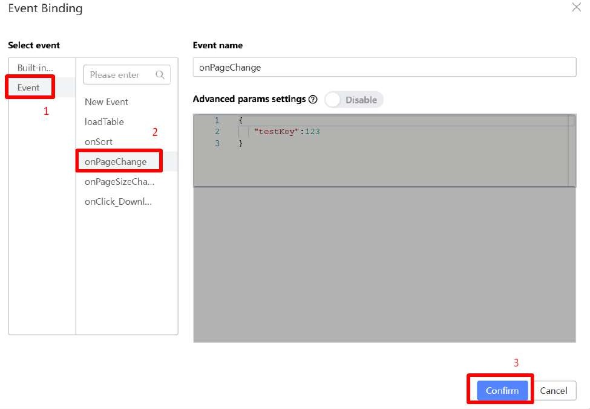
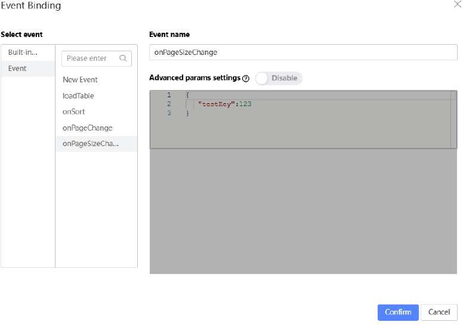

# Tutorial 5: Tables, Sorting and Pagination

This tutorial covers the following Learning Objectives:

Understand how to create and structure tables in KAIZEN to display data effectively.

Learn how to implement client-side sorting functionality to allow users to organize data by different columns.

Explore how to add client-side pagination to tables to manage large data sets efficiently.

Discover how KAIZEN simplifies the integration of sorting and pagination features to enhance user interaction.

In this tutorial, you will learn how to create and manage tables in KAIZEN to display data clearly and efficiently. We’ll guide you through implementing sorting and pagination features, allowing users to interact with and organize large sets of data easily. By the end of this tutorial, you'll be able to enhance your application’s data presentation with dynamic, user-friendly tables.

For this example, we will be doing a registered course list table, containing the Course Name, Course Code, Subject, Enrollment Type, Duration, Schedule, Price and the number of Students enrolled.

## Practical 5.1: The Table Component

The Table Component is a template that you can use to create tables for your projects with relative ease. You can find it in the Component Library as a component called ‘Table’. Simply drag it out into the design space as you would any other component and should work.

Setting up the Table Component

Create a new Course Table Page.

From the Component Library, drag out the Table Component into the Cell in the Design space.

Under Props:

Remove the Add and Edit buttons by deleting them under the Action Bar

Delete the Edit and Preserve links under the Action Column as well

Under Styles, change the width of the Table to 100%.

Go to the Props tab and go to Style and theme.

Turn on the Fixed Header switch and then

Set the Max body height to 800px.

Setting the Table Headers

The configuration for changing the headers are located in the Props tab of the Table itself under Data Column. You can change these values and it will reflect on the Design space. Add and/or remove the headers accordingly with the buttons in the Data Column menu.

Recall that we will need to add headers for:

Course Name

Course Code

Subject

Enrollment Type

Duration

Schedule

Price

Students

You should have something like this:

Adding a Static Dataset to the Table

Now that the table is set up, it is time to add the content to each row for testing.

The Table Component parses JSON and uses it to generate the data it displays on the rows. Each Key in a JSON object will correspond to the header in the table and each Value in a JSON object will be the row value.

We can add the row values through 3 different ways under the Props tab > Data Column of the Table Component:

Click on the ‘Edit Data’ button. Modify the JSON accordingly.

Add the JSON data into the Source Code Panel in the Designer, then variable bind it.

Retrieve the data from an external datasource, like a backend server, then apply

variable binding to it.

For today, we will only be covering (b) in detail:

Open the Source Code Panel. Copy the entire file from below: Tutorial5-code.txt

Click Save on the top-right of the Source Code Panel.

Select the Table Component and under Props tab > Data Column, click on the Variable Binding (the {/}) for Data Source.

Under the Variable List, select State Attribute > table. Click on Confirm

Notice the data in the table has changed.

You can see that the headers are there, but the data it is displaying doesn’t look right. Let’s figure out what’s wrong:

Select the Table Component and under Props tab > Data Column, Click on the Edit

button on the ‘Course Name’ header.

Look at the Data Key field. This field takes the values of the key in a JSON object to put in the Table. So, this field must have exactly the same name as whatever the key is in our dataset.

Let’s examine one of the entries in the data we put in the Source Code Panel earlier:

We can see that the key, ‘name’, in this JSON, corresponds with ‘name’ in our own ‘Course Name Header. So that explains why the Table has those rows under ‘Course Name’ populated even though we have not done anything yet.

Now that we have figured it out, all that’s left to do is to change the rest of the headers.

On Props tab > Data Column, edit each header’s Data Key:

Once done, you should have a table like this:

## Practical 5.2: Table Sorting & Pagination

Now that we have the table set up, it's time to look at some other features we can add to this table, namely table sorting and pagination.

Setup

Open the Source Code Panel. Uncomment the lines 253 - 273.

The code block that you uncommented is for table sorting.

Sorting

In order to sort a table, we will first need to determine which data columns will be sortable and then set them as such in the Designer.

The 4 columns that will be sortable are:

Course Name

Duration

Price

Students

Under Data Column, Click on the Edit button beside the Course Name header.

Enable Allow Sorting.

Repeat the same steps for Duration, Price and Students

Note in the Table in the Designer’s display area has changed the column to have an up/down arrow beside the headers you have changed. Clicking on it does nothing for now. We will need to do some event binding.

Under the Events tab, click on the Component native event button.

In the dropdown, select the onSort event.

In the popup, select Event, click on onSort. Then click on the Confirm button.

We should now be able to sort by clicking on the headers in each column.

Pagination

Something you probably noticed is that the table is only displaying 10 entries even though the dataset has 22 entries in total. That’s because the Table and the code placed in the Source Code Panel has catered for pages in the table. However, there is no way to navigate the pages or change the page size. Let’s change this.

Open the Source Code Panel. Uncomment lines 277 - 282

Under the Pagination Configuration, click on the Variable Binding for field Current Page

Under Variable List, Select ‘State attribute’ then select ‘currentPage’.

Still under the Pagination Settings, click on the Variable Binding for ‘Total records’.

Under Variable List, Select ‘State attribute’ then select ‘dataCount’.

Still under the Pagination Settings, click on the Variable Binding for ‘Show page size’.

Under Variable List, Select ‘State attribute’ then select ‘pageSize’.

In the OnChange field, click on the Bind Function button.

Under Event, click on the onPageChange event.

In Preview mode, now you can click on the pages at the bottom-right of the table and each page should display each page set of data correctly.

Page Sizing

Let’s continue to add a Page Size feature.

Open the Source Code Panel. Uncomment lines 286 - 293.

In the Selector type field, choose ‘Dropdown’.

Page size list should be ‘5,10,20’

In the OnPageSizeChange field, click on the ‘Bind Function’ button.

Under ‘Select event’, Click on ‘Event’, then click on ‘OnPageSizeChange’.

Click on the ‘Confirm’ button.

These are the options you should have:

Now you can Preview to check all the changes that we added.

## Practical 5.3: Download functionality (Optional)

Sometimes there is a need for the user to download files or data from your end. It is possible to do this with the Designer’s Source Code Panel. In this Practical, we will add a button that allows users to download the JSON data of the table we did in the previous Practical.

Add a download button

Add a block to the bottom of the table.

Drag a Button Component to Cell.

Do some styling for the button and rename it to ‘Download Data as JSON’.

Add the download code

Open the Source Code Panel. Uncomment the lines 297 - 301.

Event bind the download button

Click on the Button Component and go to the Events tab and click on the ‘Component native event’ button. In the dropdown, click on ‘OnClick’.

Under ‘Select event’, Click on ‘Event’, then click on ‘OnClick_Download’.

Click on the ‘Ok’ button.

Now, whenever you click on the Download button, you will start downloading a JSON file

with the table’s data.

