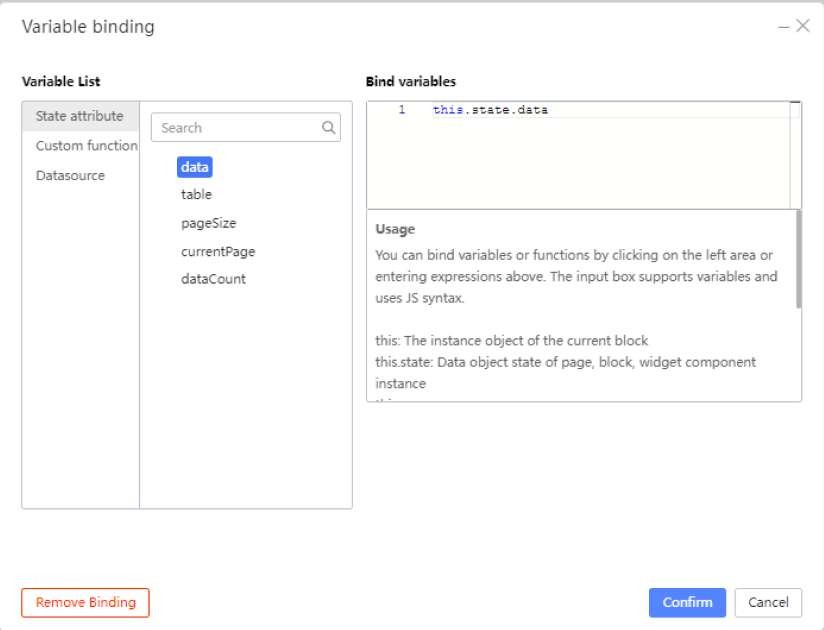

# Tutorial 6: Charts and Graphs

This tutorial covers the following Learning Objectives:

Understand how to integrate and display various types of charts and graphs in KAIZEN.

Learn how to visualize data effectively using different chart types like bar and pie charts.

Explore how to bind data dynamically to charts for real-time updates.

In this tutorial, you will learn how to create and display charts and graphs in KAIZEN to visualize data effectively. We’ll guide you through selecting the right chart types and binding them to dynamic data, enabling real-time updates. By the end of this tutorial, you'll be able to enhance your application with informative and interactive visualizations that help users interpret data quickly and easily.

## Practical 6.1: Adding Graph Components

Setup Steps

From the Component Library, drag a Cell Component to the top of the Table in the Course Table Page that you have created from Tutorial 5.

Drag a Tab Component into the Cell Component.

Rename the tabs (and remove any extra) so that there are only these 2 tabs: ‘Price Comparison’ and ‘Enrollment’.

Once you are done, you should have something like this:

Adding a Bar Graph

Select the ‘Price Comparison’ tab in the Tab Component.

From the Component Library, search for ‘chart’ and drag a Bar Chart Component (aka Column Component) into the Price Comparison Tab.

Sending Data to the Graph

Select the Column Component and under the Props Tab, click on Variable Binding.

Under ‘Variable List’, Select ‘State attribute’, then select ‘data’.

Click the ‘Confirm’ button.

Note the graph has disappeared.

Change the ‘x-axis label’ to price and the ‘y-axis label’ to name.

With the Bar Chart Component still selected, go to the Styles tab and change the Height to 600px.

If you click on Preview, you can hover over each column to see their specific x-axis labels.

Adding a Pie Chart

Select the ‘Enrollment’ tab in the Tab Component.

From the Component Library, search for ‘chart’ and drag a Pie Chart Component into the

Enrollment Tab.

Sending Data to the Graph

Select the Pie Chart Component and under the Props Tab, click on Variable Binding.

Under ‘Variable List’, Select ‘State attribute’, then select ‘data’.

Click the ‘Confirm’ button.

Note the graph has disappeared.

Change the ‘Value field name’ to student-no and the ‘Category field name’ to name.

With the Pie Chart Component still selected, go to the Styles tab and change the Height to 600px.

If you click on Preview, you can hover over each column to see their specific category names. You can also hover over each item in the legend to highlight their position in the pie chart.

In the Legend, you can also click on an item to deselect it and prevent it from showing up in the Pie Chart.

