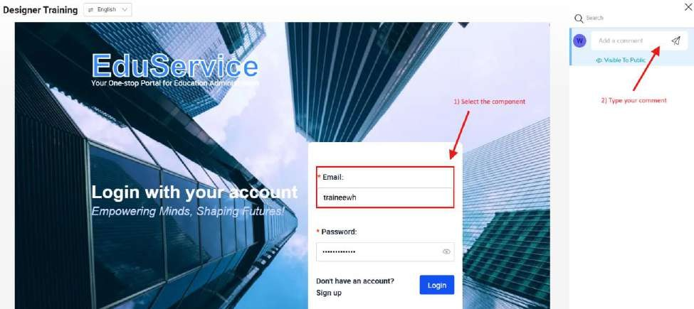
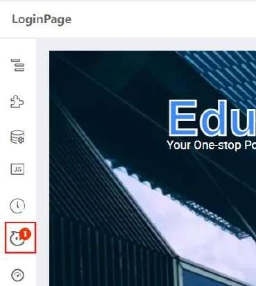
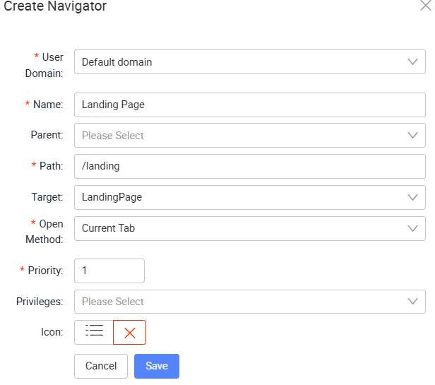
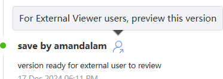

# Tutorial 9: Preview Mode

## Practical 9.1: Preview Mode and Collaborative Commenting

This practical covers the following Learning Objectives:

Learn how to enable preview mode in your application for testing and review purposes.

Understand how to implement collaborative commenting to allow team members to provide feedback on the application.

Enhance team collaboration by providing a seamless workflow for reviewing and improving your application before publishing.

In this practical, you will learn how to enable preview mode in your application, allowing you and your team to test and review changes in real-time before finalizing them. Additionally, we will guide you through implementing collaborative commenting, so team members can easily provide feedback and suggestions. This feature enhances collaboration and ensures that all stakeholders can participate in the review process to improve the application before it goes live.

Navigating back to the shared project that all trainees can access -

TrainingFoundation, click on the ‘Preview’ button the application.

In preview mode, click on the Comments icon near the sidebar.

Select a component, and type the comment in the comment box.

Note that you can toggle the visibility of your comment to either “Visible to Public” or “Visible to Internal” by clicking on the text below the comment box. This is useful in the event that a project member wants to leave a comment to internal team members, which should not be visible to the customers when they preview this page.

Navigating back to this page in the App Designer, click on the Comments icon to bring up the list of comments relating to this page. You will be able to access and see the comments added by all users.

## Practical 9.2: Navigator Creation / Page Linking

This practical covers the following Learning Objectives:

Learn how to create and organize navigators within your application.

Explore how to enhance user experience by designing intuitive and easy-to-use navigation menus.

Learn how to create a custom navigator and menu within your application.

Customize the user experience by creating tailored navigation flows.

Understand how to link pages efficiently to ensure smooth navigation for users.

In this practical, you will learn how to create navigators for your application, enabling users to easily navigate between pages. We’ll guide you through the process of linking pages effectively, ensuring that the navigation is intuitive and user-friendly. By the end of this tutorial, you will be able to design and implement an organized, seamless navigation system that improves the overall user experience within your application.

Navigator Creation

Navigate back to your own project and application.

Click on Navigator to edit the setting

Now, when you preview your application, you will be able to see your newly created navigator, which brings you to the Landing Page upon click.

Customize Navigator Menu

After creating your Navigator Menu, you will learn how to customize the navigators and menus for your application, providing a personalized user experience.

Preview your application.

Click on the Setting icon in order to start customizing your navigator menu. We will now proceed to edit the menu color.

In the settings, note that there are many CSS properties to change navigator menus

Change the Navigation Mode to ‘Top Menu Layout’

Edit “Menu Item Hover Font Color” to change menu color on hover

Click on “Save To Application”. This will save your changes across all pages to your entire application. If you only want to customize at page level, you can click on “Save To Page” instead.

Page Linking

Once all your pages and Navigator Menus are created, we can connect them to ensure a seamless experience by binding the onClick event.

In your Login Page, bind the onClick event.

Add the following code in the JS Source Code Panel.

The navigateTo function takes in two parameters, the “App ID” and “Page ID”. Replace

with your application IDs accordingly.

Save your changes and try to login in preview mode! Your page should navigate over to the landing page successfully.

## Practical 9.3: Page Tagging for External Review (Demonstration)

This practical covers the following Learning Objectives:

Learn how to implement page tagging for external review, enabling stakeholders to view specific versions of your application.

Understand how to manage and control which updates are visible to external reviewers while hiding upcoming revisions.

Explore how to tag pages for review, ensuring customers can only view the current version and not unfinished updates.

In this practical, you will learn how to use page tagging for external review, which allows you to mark specific versions of your application for stakeholder review. By tagging pages, you ensure that external reviewers can only see the current version of the application, while any ongoing revisions remain hidden. This feature helps to maintain a clear and organized review process, ensuring that external feedback is based on a consistent, unaltered version of the product.

We will be using the Designer Training application in our TrainingFoundation project.

Under the revision history of each page, you can click on the button for external viewers to preview that particular published version. Subsequent versions with further enhancements by the project team will not be visible to external viewers when they preview the application.

We have assigned a customer user account with an external viewer role assigned for this application as seen to demonstrate this.

Now as a customer, the customer will only be able to see this version tagged for them to review and not subsequent versions when previewing this application.

