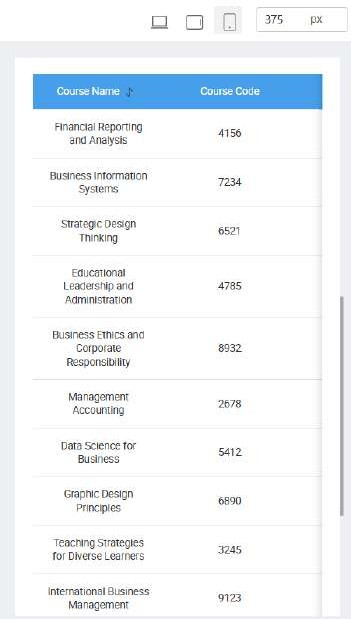
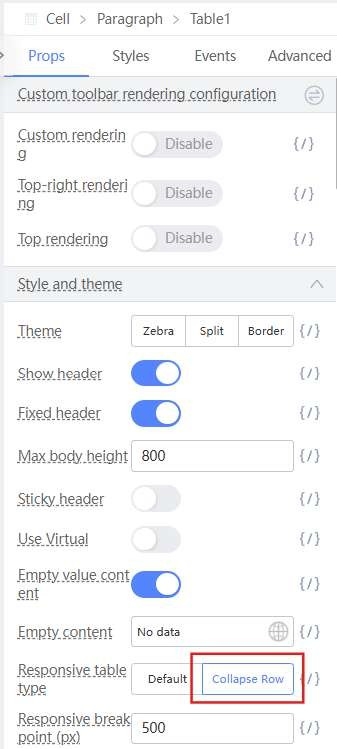
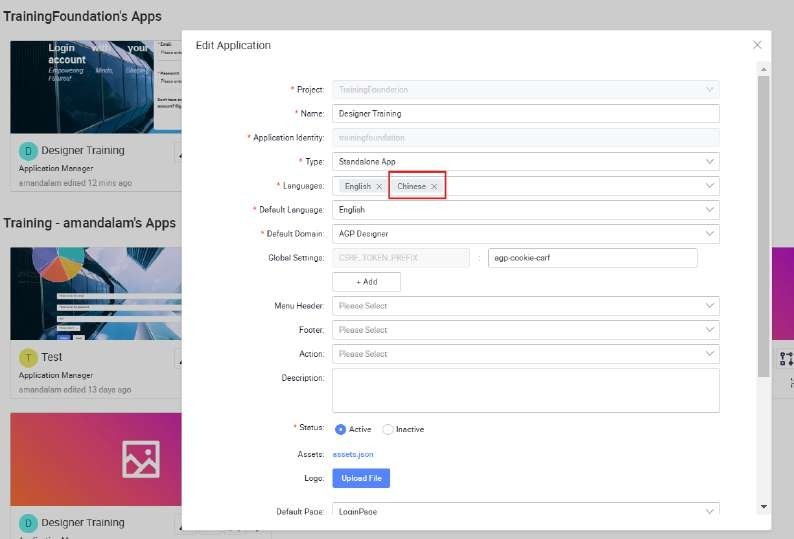

# Tutorial 10: Page Improvement

## Practical 10.1: Page Analysis with Page Scan (Demonstration)

This practical covers the following Learning Objectives:

Understand how to perform a comprehensive page scan using the platform's built-in tool which analyzes web apps and web pages, collecting modern performance metrics and insights on developer best practices.

Analyze key metrics such as Performance, Accessibility, Best Practices, SEO, and Progressive Web App (PWA) compliance to identify areas for improvement.

In this practical, you will learn how to use the platform's page scanning capabilities to evaluate your pages against industry-standard metrics, optimize them for better performance and accessibility, and ensure they meet the latest web development best practices.

Select the “Page Scan” plugin and click ‘Analyze Page’.

Upon scanning, you will also be able to download the report of the page scan which will also give you further insights such as recommended changes to your page.

## Practical 10.2: Mobile Responsive UI (Demonstration)

This practical covers the following Learning Objectives:

Learn to configure table rows to collapse for optimal display on smaller screen sizes.

Explore adaptive design techniques to ensure usability across various device types.

In this practical, you will learn how to apply the collapse row feature to optimize table data presentation for small screens, which is one of the mobile responsive features provided.

Navigate to the Course Table page and click on the ‘mobile’ view icon.

When you scroll down to the table, notice that its view is not user friendly when in mobile screen size as you need to navigate via horizontal scrolling.

Click on the table. In props, select ‘Collapse Row’ for responsive table type.

Notice that your table will now be collapsed on mobile view, which is a more intuitive and user friendly interface.

## Practical 10.3: Translation using i18n (Demonstration)

This practical covers the following Learning Objectives:

Learn how to add multi-language switching functionality to your application using i18n.

Enhance user accessibility by supporting global audiences with multiple language options.

In this practical, you will learn how to integrate translation functionality into your application using the i18n standard. This feature allows users to switch between different languages seamlessly, making your application accessible to a wider, global audience. You’ll explore how to add and configure language files, making your product user-friendly across different regions.

In the TrainingFoundation project, the “Chinese” language has already been added into

the application settings in Languages.

Each text’s Chinese translation has already been pre-filled as well.

Select “Chinese” in the dropdown

In Designer mode, note that language is switched to “Chinese”.

Similarly in Preview mode, note that the page’s language can also be switched to “Chinese”.

