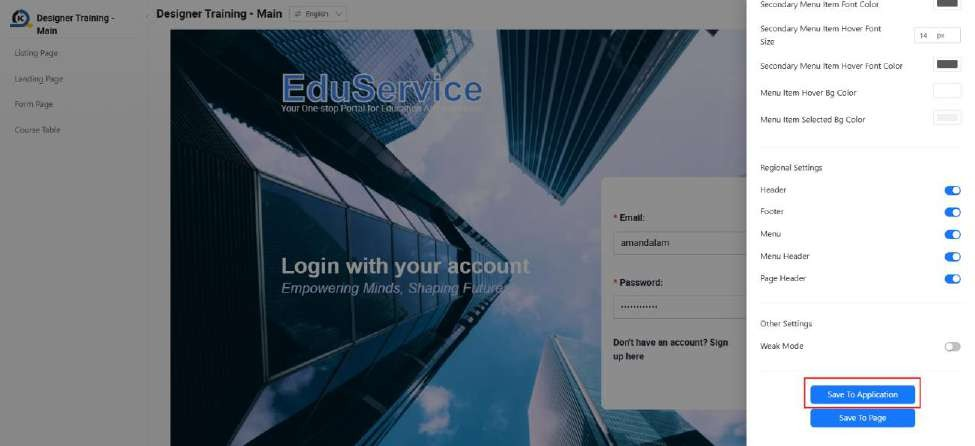
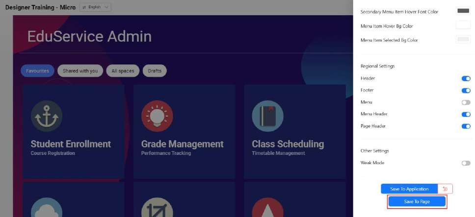
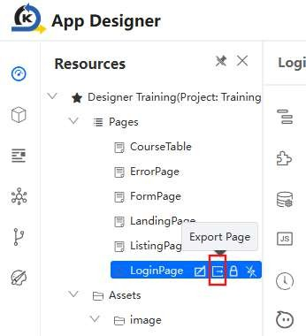
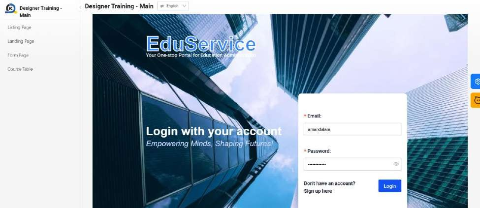
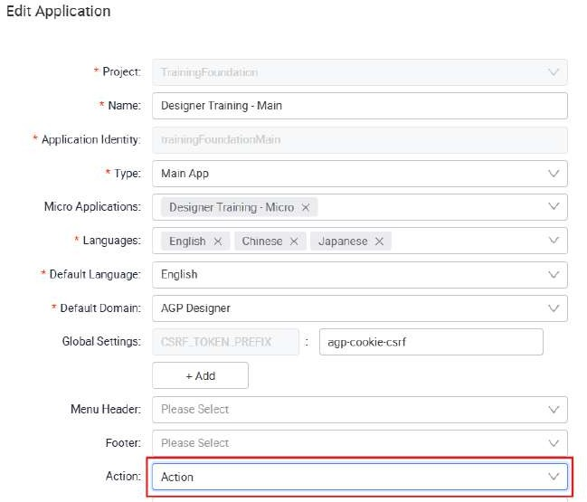
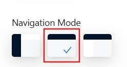
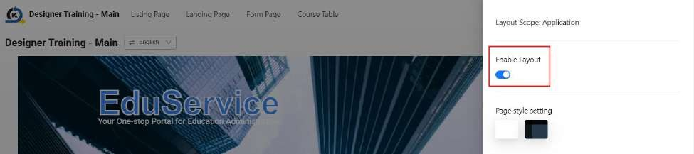

# Tutorial 12: Main and Micro Applications

This tutorial covers the following Learning Objectives:

Understand how to set up and manage a main application and micro-application architecture.

Learn the advantages of micro-application architecture for scalability and flexibility.

In this tutorial, you will learn how to set up a main application with micro-applications. Micro- application architecture allows you to split your application into smaller, more manageable components, which enhances scalability, flexibility, and performance—an ideal solution for rapidly evolving environments. This aligns with the micro-frontend framework.

These two Main and Micro applications have been created for you. Your current Designer Training Application that you have been working on is a “Standalone” application type.

Generally, the Main application will contain the menu and it will load child Micro application(s). Note that one Main application can be tied to multiple micro applications.

Navigator should be done in the Main application. Refer back to Practical 9.2 for more details.

Customization of global layout should be done in the Main application via ‘Save to Application’ function. Refer back to Practical 9.2 for more details.

Customization of individual layout should be done in the Micro application via ‘Save to Page’ function. Refer back to Practical 9.2 for more details.

## Practical 12.1 Export and Import Pages to Main/Micro Apps (Optional)

This practical covers the following Learning Objectives:

Understand how to export and import pages in the App Designer.

In this practical, you will learn how to export and import your pages for use. This will be required in development when you need to either duplicate your existing pages in your application for ease of development, or in the case of this tutorial, to import pages into other applications.

In your Designer Training application, we will first export the login page and import it over to the Main application.

Export Login Page from your original Designer Training application

Import into the Designer Training - Main application

Do the same for the rest of the pages and import it accordingly as follows. Ensure to save and publish your applications once all imports are done.

Designer Training - Main

Login Page

Designer Training - Micro

Listing Page

Landing Page

Form Page

Course Table

Create the navigator in your main app to point to all 4 pages in the micro app.

Once you preview your main app, you will be able to navigate to the different pages via the menu bar.

## Practical 12.2 Add Action Page Type to Main App (Optional)

This practical covers the following Learning Objectives:

Learn how to utilise the ‘Action’ type page in your applications.

In this practical, you will learn how to create a ‘logout’ button which will persist across all your application pages. In order to avoid having to duplicate global components that you want to persist on all pages (e.g. profile, logout, language toggle), you can create an ‘Action’ type page in your main application. In addition to action components, you can also create ‘Menu Header’ and ‘Footer’ type pages to persist the design of headers and footers across your application respectively.

There are a few types of pages you can create for different purposes. In previous tutorials, you have only been using the standard ‘Page’ type.

Menu Header: A navigation element used to group related pages under a common section in the application’s menu. It helps organize and structure the navigation for better usability.

Footer: A section that appears at the bottom of the application’s interface, typically used for displaying copyright information, quick links, or additional navigation options.

Action: A page type designed for action components that persist across all pages in the application, such as profile settings, logout, and language toggle. These components remain accessible regardless of the user's navigation.

Page: The standard content page where users can design and display UI components, input forms, data tables, and other interactive elements. This is the primary type used for building application interfaces.

For this tutorial, create a new ‘Action’ page in your main app.

Drag a Button component into the page.

Set the button with the following styles and code. Save and publish your page changes.

In the Resource panel, click on the ‘edit’ icon of your main app.

Under Action, select the ‘Action’ page that you have just created and click ‘Save’.

In preview mode of your main app, notice that the ‘Logout’ button added now forms part

of the page header.

Click on the Setting icon to customize your navigator menu. Select ‘Top Menu Layout’ for the Navigation Mode and click ‘Save To Application’.

Now, the ‘Logout’ action button will appear at the top right across all pages.

However, you may not want your action buttons to appear on all pages. In this case, it would not make sense to have this button (or access to the other pages via the menu bar) on the first Login page. Hence, you can choose to customize your navigator menu further by disabling the layout for the login page and clicking on ‘Save To Page’.

Once you have logged in, you will be able to see the navigator menu and ‘Logout’ action

button across all other pages.

