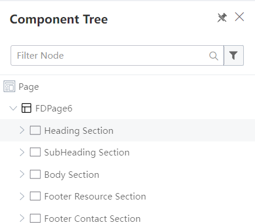
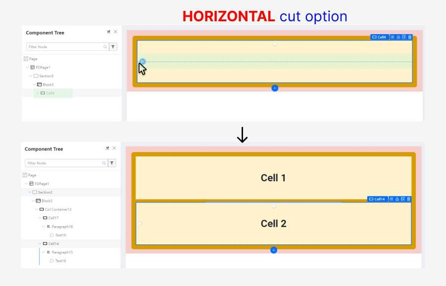
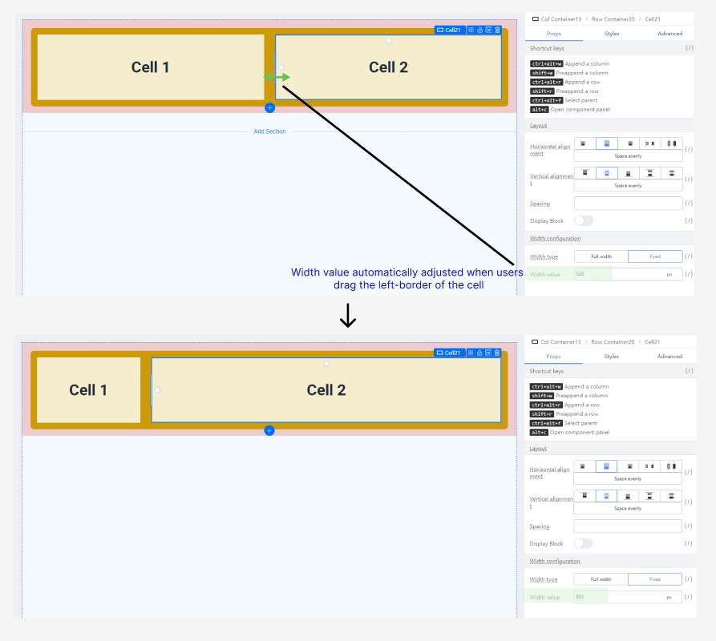
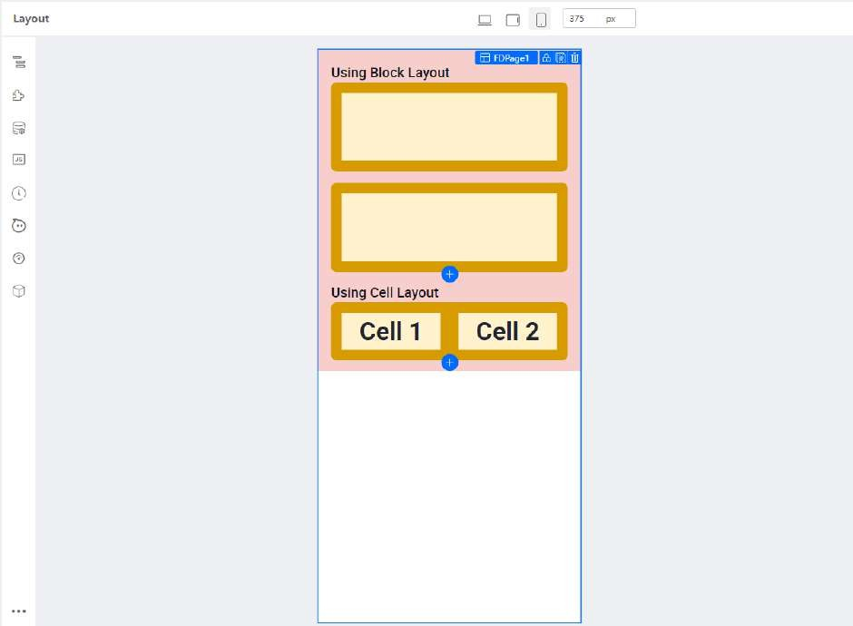

# Tutorial 13: Build screen skeleton

This tutorial covers the following Learning Objectives:

Learn how to build the skeleton structure of a screen within your application.

Understand how to create a layout framework that can be easily customized and populated with content.

Explore the process of designing a flexible and responsive screen skeleton that ensures scalability and consistency.

In this tutorial, you will learn how to build the basic framework, or skeleton, of a screen within your application. The screen skeleton serves as the foundation upon which you will add content and functionality. We will guide you through the process of structuring the layout, ensuring it is flexible and can easily adapt to different screen sizes. By the end of this tutorial, you’ll be able to create a consistent and scalable screen layout that forms the core of your application’s user interface.

Key Concepts

We will start by introducing the hierarchy structure of Section, Block and Cell (Parent-Child relationship).

Section can contain Block

Block can contain Cell, but cannot contain Section

Cell cannot contain Section and Block

Hierarchy:

## Layout: Section vs Block

Section:

Organization: Takes up the entire width (100%) and provides a clear and structured way to organize content. Each section can represent a distinct topic or category, making it easier for users to navigate and understand the layout.

Customization: Sections allow for more customization options in terms of layout, styling, and functionality. You can apply different designs, backgrounds, and behaviors to each section as needed.

Scalability: Sections offer scalability, allowing you to easily add or remove content sections without affecting the overall layout. This flexibility is particularly useful for websites or applications with dynamic or evolving content.

Readability: By dividing content into sections, you can improve readability and comprehension for users. Clear demarcations between sections help users understand the flow of information and locate relevant content quickly.

Block:

Granularity: Using multiple blocks allows for a more granular approach to content management. Each block can represent a smaller unit of content or functionality, giving you finer control over the layout and presentation.

Flexibility: Blocks offer flexibility in arranging content within a section. You can easily rearrange blocks or add new ones without restructuring the entire layout, providing greater adaptability to changing requirements or user preferences.

Example (Using Section)

Using the https://amazon.sg website as an example, we will explain why it is preferable to use Sections over Blocks

Creating the skeleton of amazon.sg website in KAIZEN

Example (Using Block)

Using the Twitter (https://twitter.com) website as an example, we will explain why it is preferable to use Blocks over Sections

## Layout: Block vs Cell

Block:

Supports Vertical Cut option

Uses structured grid layout  through configuring “Col Span” property

Granularity: Using multiple blocks allows for a more granular approach to content management. Each block can represent a smaller unit of content or functionality, giving you finer control over the layout and presentation.

Flexibility: Blocks offer flexibility in arranging content within a section. You can easily rearrange blocks or add new ones without restructuring the entire layout, providing greater adaptability to changing requirements or user preferences.

Cells:

Supports Vertical and Horizontal Cut option

Uses flex layout through adjusting the span (width)

Modular Layouts: Cells allow for modular design by segmenting content into smaller units within a Block.

Flexible Styling: Provides flexibility in styling individual cells, including formatting, borders, padding, and other visual properties.

Tabular Data Presentation: Ideal for presenting tabular data with rows and columns, enhancing readability and organization.

## Block VS Cell

In Desktop view, the layout structure for Block and Cell looks like this:

In Mobile view, the layout structure looks like this:

By default, using Block will have a responsive layout wrap behavior, while Cell does not.

## Example: Webpage walkthrough example

We will use the following webpage as an example to walk you through the methodology when creating page skeleton:

Step 1: Create layout

*To illustrate the example clearer, I will apply background color to Section, Block and Cell

Step 2: Divide cell horizontally for left block

Step 3: Split cell into two

Step 4: Add a card component

Step 5: Add 3 Card components

Step 6: Add a table component

Step 7: Add components to the right block

** We have included few other examples below to demonstrate the drawing of screen skeleton

Example

Building Screen skeleton examples

