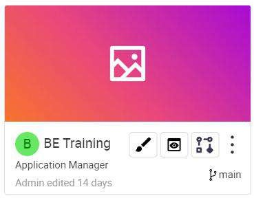
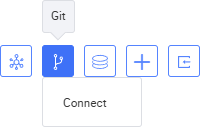
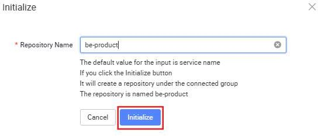
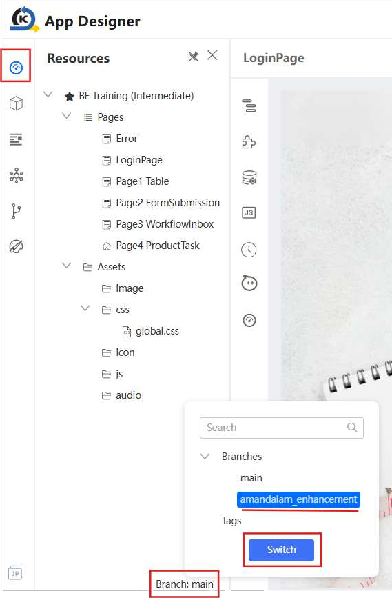
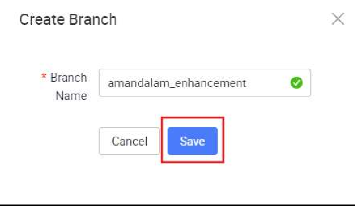

# Tutorial 14: Git Setup & Creation of New Branch

This tutorial covers the following Learning Objectives:

Understand how to set up Gitlab in KAIZEN for version control.

Creation of new branch

In this tutorial, we’ll learn how to connect a project to a GitLab repository for efficient version control. This Git integration feature allows users to seamlessly connect their projects to a Git repository, enabling direct version control operations from within the application in KAIZEN. We will also learn how to initialize new repositories directly from KAIZEN. This integration enhances the CI/CD pipeline by automating the process of committing and pushing changes, thus improving efficiency and collaboration. Additionally, we will also learn how to create a new branch in order to work on feature enhancements or bug fixes in a project setting.

## Practical 14.1: Connect with Gitlab

In this GitLab environment, a group “KAIZEN-Training” has already been created for the purpose of this training. In addition, a sub-group has also been created for each trainee prefixed with your username ‘kaizen-training-<username>’ (E.g. kaizen-training-amandalam).

Similarly, in your project’s context, you may create subgroups for different applications required in your project (E.g. FE internet portal, BE intranet portal), and each subgroup will then be initialized with your application repositories. After which, you may then connect to Git in KAIZEN by configuring the respective group.

Navigate back to your KAIZEN studio console, you will notice that the current branch for your application is on ‘main’. We will go through a later tutorial on Git Branch Management to allow you to push your changes onto your repositories.

Generate Gitlab Personal Access Token

Login to your gitlab account as follows and reset your password

URL: http://alb-kaizen-daasez-001-673358367.ap-southeast- 1.elb.amazonaws.com/

Username: <username>

Password: ahdoh6shaechaip0seidu1ahnailoogaeF8Ainie

Navigate to your gitlab account profile, click Edit Profile

Click on Access Tokens

Create your personal access token

Token name: access_token

Expiration date: leave as default

scope: api, read_api, read_repository, write_repository

Copy the generated token to store it for later use

Connect to Git

On the KAIZEN studio console, click on the Git button of your BE Training project and click Connect.

Select Gitlab as the service provider and click Next

Enter the following details to connect to Gitlab

URL: http://gitlab-http-svc.kaizen-devops.svc.cluster.local

Personal Access Token: <token-string>

Group: kaizen-training/kaizen-training-<username>

Click on Test Connect to test your connection

The group to specify is the url path of your group and subsequent subgroups where you will be initializing your project.

Note that if the “Separate BE Group” checkbox is selected, then “Group” will specify the group for your Frontend Repository and “BE Group” will be for your Backend Repository. If it is not selected, then both FE and BE will be connected to the same Git group. This is to help aid in development such that you will not need to always re-connect to another group path in the event you want to push your code in your BE repository.

Once successful, click on Save to connect.

## Practical 14.2: Initialize Git Repository

Frontend - Initialize Git Repository

Click on the Design icon of your application. It will navigate to the App designer of your application

In the left panel area, click on the Git icon. Notice that you are already connected to Git. You may click on Settings to verify.

Click on the button Initialize

In the popup, input the following and click on Initialize to create the gitlab repository:

Repository name: fe-product

Verify the following initialized frontend repositories in your gitlab project.

Currently, these initialized repositories are empty. In the later tutorial we will show you how you can generate and push your code into these defined repositories.

Backend - Initialize Git Repository

Backend - Create Service (Prerequisite)

You may initialize your BE repository through the Service Designer after the creation of your microservice(s).

Let us first create an empty Product Service first so that the BE repository can be initialized. Note that a microservice for your application needs to be created first before you can initialize your BE Git repository. Not to worry as we will cover more details on the Service Designer tutorial below.

Click Services to launch the user interface.

Select Add Service in the Service API Designer.

In the configuration panel, name your microservice to represent its function (e.g.,

"Product” for Product microservice). Click Apply.

In the Service Designer, the Product Service has a couple of features which we will explore further in later tutorials.

In your Service Designer, click on the Git icon (Manage Branch) on your Service.

Click Initialize to set up your BE repository.

You should be able to see this newly created repository reflected on Git as well.

KAIZEN will create these 3 repositories under the defined group.

Note:

If you connect to git again with the repositories already present and initialized, clicking on the initialized button will not create new repositories. The success message will flag out accordingly that this repository with this name has already been initialized when connecting.

## Practical 14.3: Create and Switch to new branch

In KAIZEN, frontend Git branch management is essential for maintaining an organized and efficient workflow. By creating separate branches for UI changes, such as theme updates, new features or bug fixes, developers can isolate modifications, avoid conflicts, and ensure smooth collaboration across teams. This approach supports parallel development, minimizes disruption to the main codebase, and allows for better testing and integration of frontend updates, ultimately enhancing project quality and stability.

Frontend Git Branch Management

In your App Designer, click on the Git icon menu item on the left panel. Then, click on the + icon to create a new branch

In the pop-up window, enter the following details

Branch Name: <username>_enhancement (e.g. amandalam_enhancement).

This will create a new branch based on the current branch that you are on, in this case, ‘main’. You can then work on your feature enhancement and make the relevant changes to this newly created branch.

You should be able to see this newly created branch reflected on Git as well.

Navigate back to your application’s resources by clicking the Resources icon

In the app designer. You may switch to the new branch by clicking on your application’s

current branch as shown below.

Alternatively, you may also switch to the new branch by clicking the Git branch on your application from the studio console.

Note that switching of branches on KAIZEN is a personal setting and is tied to individual users. Hence, if another project member switches branches, it will not be reflected on your application.

Ensure that your ‘Training Environment’ profile is checked in the new branch as well.

Backend Git Branch Management (Optional)

Similarly for BE, we will proceed to create a new branch in the Service Designer. This will allow us to work on our new feature enhancements before merging into the main branch.

You should be able to see this newly created branch reflected on Git as well.

Switch to the new branch from the service designer. Select the branch to switch to in

the dropdown and click ‘Apply’.

