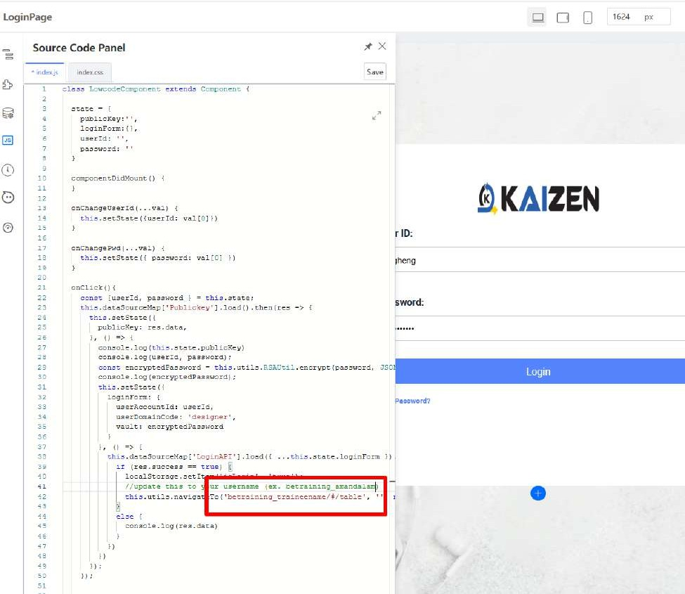

# Tutorial 16: Custom Login Page Integration

This tutorial covers the following Learning Objectives:

Learn to integrate a custom login page for your application.

Understand how to connect your custom login page with IAM (Identity and Access Management) service.

Secure your application with enhanced authentication mechanisms.

In this tutorial, you will learn how to customize and integrate a login page into your application, backed by the IAM service in KAIZEN. This allows you to provide a secure and user-friendly login experience while ensuring that user authentication aligns with your organization’s identity management policies.

## Practical 16.1: Login Page Integration

All necessary backend APIs for authentication have already been configured, allowing you to focus on designing and implementing the front-end aspects of the login page.

Update the path with your username in the Source Code

betraining_amandalam

