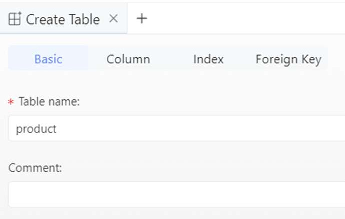

# Tutorial 17: Database Designer

This tutorial covers the following Learning Objectives:

Understand how to create, modify, and manage database schemas using the Database Designer within the low-code platform.

Learn to automate the generation of Database Access Objects (DAOs) by configuring them through the Database Designer.

Effectively manage your database scripts within a centralized platform for improved organization and accessibility.

In this tutorial, you'll explore the Database Designer feature within KAIZEN, which allows you to design and manage your application's database with ease. Instead of manually writing SQL queries, the designer provides a user-friendly interface to create tables, define relationships, and structure your data model. This feature helps streamline database management and ensures that your data structure is aligned with your application's requirements.

## Practical 17.1: Setup Database and tables

Each trainee is provided with a central PostgreSQL database for the practical. Ensure you have the correct database credentials (hostname, username, password, and database name) before proceeding.

Connect to the PostgreSQL Server

In the studio console, go to your project and click Database Designer to launch the user interface

Click Connections and select PostgreSQL

Enter the following configuration details:

Host: 172.20.0.141

Port: Use the default PostgreSQL port (usually 5432)

User: <username>

Password: tr@ining2025

Database: trg_single

Test the connection. Once successful, click on Save

Creating a New Table

To create a table, right-click on the Tables section under the created schema and select

Create Table.

In the right-panel section under Basic, enter the table name product

Under Column, click on Add column to add new columns

Define the following columns for the product table

Click Save

Click Run in SQL preview

CREATE TABLE "product" (

"id" SERIAL NOT NULL , "name" VARCHAR(64) NULL , "price" VARCHAR(64) NULL ,

"category" VARCHAR(64) NULL , "status" VARCHAR(64) NULL , "brand" VARCHAR(64) NULL , "color" VARCHAR(64) NULL ,

"location" VARCHAR(64) NULL , "pdf_data" BYTEA NULL , PRIMARY KEY ("id")

);

After creating the table, expand the Tables section under the schema to view the newly created table.

Adding Rows to Table

In a development environment, it is often necessary to quickly add data to a PostgreSQL table for testing purposes. There are two main ways to add data to a PostgreSQL table: manually through the user interface or by running SQL scripts. Below are the steps for both approaches.

Right-click on the table and select Open Table.

In the right panel, select Add Row (+)

Enter the following details to the new row for the first record

id: 1

name: Product A

price: 499.99

category: Electronics

status: Approved

brand: Brand X

color: Black

location: Singapore

pdf_data: <null>

Click Submit to save the new row

Alternatively, we can select the Query console to run SQL scripts. Right click on table and select Query console

Paste the SQL script below in the console and click Run

INSERT INTO product (id, name, category, brand, color, status, price, location) VALUES

(2, 'Product B', 'Clothing', 'Brand Y', 'Blue', 'Approved', '29.99', 'Singapore'),

(3, 'Product C', 'Electronics', 'Brand Z', 'Silver', 'Approved', '899.99', 'Singapore'),

(4, 'Product D', 'Clothing', 'Brand X', 'Blue', 'Approved', '49.99', 'Singapore'),

(5, 'Product E', 'Electronics', 'Brand Y', 'Black', 'Approved', '99.99', 'Singapore'),

(6, 'Product F', 'Home', 'Brand Z', 'Brown', 'Approved', '599.99', 'Singapore'),

(7, 'Product G', 'Clothing', 'Brand Y', 'Red', 'Approved', '39.99', 'Singapore'),

(8, 'Product H', 'Electronics', 'Brand X', 'White', 'Approved', '399.99', 'Singapore'),

(9, 'Product I', 'Clothing', 'Brand Z', 'Gray', 'Approved', '59.99', 'Singapore'),

(10, 'Product J', 'Electronics', 'Brand Y', 'Silver', 'Approved', '149.99', 'Singapore'),

(11, 'Product 404', 'Electronics', 'Brand Y', 'Silver', 'Approved', '149.99', 'Singapore'),

(12, 'Product 400', 'Electronics', 'Brand Y', 'Silver', 'Approved', '149.99', 'Singapore'),

(13, 'Product 500', 'Electronics', 'Brand Y', 'Silver', 'Approved', '149.99', 'Singapore');

Back to the Table tab, we click Refresh and see the updated list of rows in the table

Benefits of Database designer

The Database Designer tool supports automatic generation of Data Access Objects (DAO) during code generation. This feature allows developers to quickly generate Java classes that map to database tables and handle CRUD operations, reducing the need for manual coding. We will explore this feature in greater detail in later tutorials.

In addition, the Database Designer also supports the automated creation of Entity Relationship (ER) Diagram and Data Dictionary for your application’s Databases.

