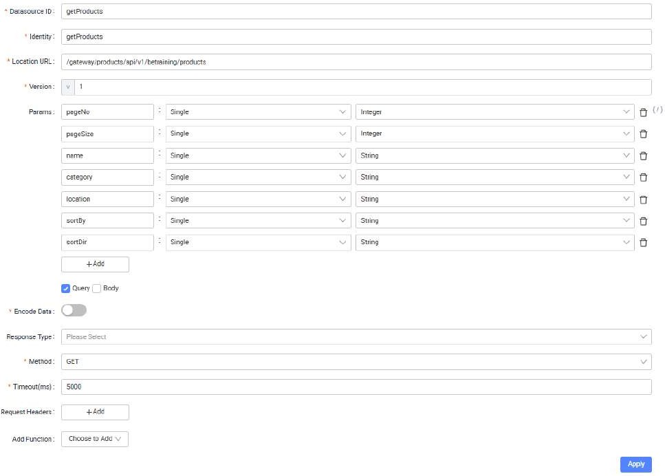

# Tutorial 18: Service / API Designer

This tutorial covers the following Learning Objectives:

Understand how to design and configure the service layer for APIs using the Service Designer feature within the low-code platform.

Learn to define and manage essential API parameters and configurations using the API Designer.

Gain insights into best practices for creating scalable and maintainable services and APIs to support application functionality.

In this tutorial, you'll explore the Service and API Designer features of KAIZEN, which allow you to build and configure the service layer for your applications seamlessly. The Service Designer enables you to design the architecture of your service layer, ensuring that it meets the requirements of your application. Meanwhile, the API Designer allows you to specify the necessary parameters and configurations for your APIs, ensuring effective communication between different components of your application. By mastering these tools, you will create robust and efficient service and API layers that enhance your application's performance and scalability.

## Practical 18.1: Creating Service and Controller

The Service API Designer in development enables users to visually create and manage APIs with minimal coding effort. It simplifies the process of defining API endpoints, adding controllers, configuring datasource, and handling data types through an intuitive drag-and-drop interface.

With built-in import/export features and code generation capabilities, the tool allows developers to efficiently design and integrate APIs into their applications. This feature streamlines API management, making it accessible to both technical and non-technical users, while ensuring that services are well-organized and maintainable.

Navigating the Service / API Designer

Click Services to launch the user interface

Familiarize yourself with the interface layout

Settings Panel (Left): Contains options like add/import service, code generation, switching branch.

Configuration Panel (Right): For configuring controllers, datasources, and more.

Adding a Service

The Service API Designer allows you to create and manage service (microservices), which serve as the backbone of a modular application architecture. Microservices enable scalable and independent components for handling different application functions. Microservices offer flexibility in development by breaking down a monolithic application into smaller, independent services that can be developed, deployed, and scaled individually. This ensures that each microservice focuses on a specific business capability, allowing for faster updates, better fault isolation, and easier scaling.

In Tutorial 11, you would have already added an empty ‘Product’ microservice in order to

initialize your Git Repository. Click on it in the Service API Designer to edit the service.

In the configuration panel, name your microservice to represent its function (e.g.,

"Product” for Product microservice").

Name: Product

This is the name of the service being created. In this case, "Product" represents a microservice responsible for managing product-related functionalities in your application.

(1st level) Package Path: com.ecquaria.lowcode

This specifies the root path at project level. Only project admin has the privilege to edit this value.

(2nd level) Service Package Path: product

This specifies the base package path where all service-related components will reside. It organizes the project structure under product, ensuring that the service logic is well-organized.

(3rd level) Controller Package: controller (Default value: controller)

The package where the controllers will be placed. Controllers handle incoming HTTP requests and route them to the appropriate service methods, providing endpoints for the API.

(3rd level) Service Package: service (Default value: service)

This defines the location for service classes. The service layer contains business logic that performs operations related to the domain (e.g., product management), sitting between the controller and DAO layers.

(3rd level) Model Package: model (Default value: model)

This package holds the data models or entities representing your domain objects. In this case, the Product model would define the structure of product data in the system.

(3rd level) Dao Package: dao (Default value: dao)

DAO (Data Access Object) package contains classes that interact with the database, executing queries and managing persistence for your models (e.g., fetching or saving product data).

(3rd level) Dao Package: vo (Default value: vo)

VO (Value Object) package represents a simple object that holds data and defines an attribute or a concept in the domain.

Priority: 0

The priority defines the importance or order of this service relative to others. A lower number (like 0) could indicate higher priority, ensuring this service is loaded or accessed first when needed.

Example of generated code structure based on the value entered:

Note the Package Path value is specified when creating the project and the value can be edited. Only project admin can edit this value. For this training, the value of com.ecquaria.lowcode is being used.

Adding a Database

Configuring a database is a crucial step to enable data storage and retrieval within the application. Integrating a new database configuration allows you to specify connection details, select tables, and set up data sources that your app can interact with directly. By configuring the database, your application can seamlessly manage and access data as part of its automated workflows and user interactions.

Click Add Database to add database configuration

Enter the following configuration details and click Save:

Connection: @172.20.0.141

Database: trg_single

Schema: <username>_schema (e.g. amandalam_schema)

Dao Package Path: <BLANK> (Default)

Tables: product

Each of the tables in 'Assigned' will generate the DAO in the code.

Usually in a project setting, you might not want to generate the DAO for all the tables in your project database for this particular microservice. In this case, you will select the relevant ‘product’ database table created.

Click Apply to create the service

Adding a Controller

Controllers in the Service API Designer act as an interface between the client (front end) and the service logic. They receive incoming requests, process them, and return appropriate responses. Controllers play a critical role in organizing API endpoints for different services. They manage the flow of data between the client and the service layer, ensuring that requests are routed correctly and data is processed efficiently. Properly structuring your controllers helps maintain clarity and scalability as your application grows.

Click Add Controller

Enter the following:

Name: ProductController

A descriptive name that reflects the functionality it controls (e.g., "ProductController" for product-related operations or "OrderController" for order- related tasks).

(4th level) Controller Package: <BLANK> (Default value: <BLANK>)

The package where the controllers interface will be placed. Controllers handle incoming HTTP requests and route them to the appropriate service methods, providing endpoints for the API.

(4th level) Service Package: <BLANK> (Default value: <BLANK>)

This defines the location for service classes. The service layer contains business logic that performs operations related to the domain (e.g., product management), sitting between the controller and DAO layers.

For illustration purpose only

In certain scenarios where we need complex application designs in controllers and services, adding a 4th layer controllers and services help make our code more maintainable. Below is an example of generated code output if 4th layer controller and service are specified in the configuration.

Adding Datasource & Configure API Endpoints

In KAIZEN, adding a datasource and configuring API endpoints allows developers to quickly connect design interfaces with live APIs. This feature enables seamless interaction between the front-end design and back-end services, supporting various HTTP methods (e.g., GET, POST) to retrieve or send data. By integrating datasource into your project, you can bind the API to the design interface, ensuring real-time communication between the user interface and actual service APIs, streamlining development without requiring extensive manual coding.

Select Add Datasource under controller

In the configuration panel, a list of configuration items are as follows:

Datasource ID: A unique identifier for the datasource, used to reference it within your service.

Identity: A unique identifier, typically a key or ID, used to distinguish and manage the specific datasource connection.

Location URL: The endpoint URL where the API is hosted, used for sending requests.

Version: The version of the API being accessed, useful for managing compatibility.

Params: Parameters passed in the URL or body of the request, such as filters or identifiers.

Query/Body: Defines where the parameters are sent, either in the query string (URL) or request body.

Encode Data: Option to encode the data before sending it, typically used for secure or structured data formats like JSON.

Response Type: Specifies the format of the response data (e.g., JSON, Text) expected from the API.

Method: The HTTP method (e.g., GET, POST, PUT, DELETE) used to interact with the API.

Timeout (ms): The maximum time in milliseconds to wait for a response before the request times out.

Request Headers: Key-value pairs sent with the API request, often used for authentication or content-type definitions.

Add Function: Allows the creation of custom functions to manipulate data or process the response after receiving it from the API.

Create a getProducts datasource as follows

Note that Params allows toggling by clicking on slash-icon (/) and +Add.We will explore other Params feature in later tutorial

The details are as follows:

The "Location URL" parameter must follow the format /gateway/<service>/api/v1, where each segment plays a specific role in routing requests to the appropriate backend microservice:

/gateway/: Serves as the main entry point, directing the request to the routing layer.

<service>: This placeholder should be replaced with the unique name of the target microservice. It allows the gateway to identify and forward the request to the correct backend service.

/api/v1: Specifies the API version to ensure backward compatibility and structured request handling.

This URL structure enables consistent routing within the microservice architecture, directing calls from the gateway to the designated backend services. Note that only requests formatted according to this convention will be correctly routed by the system

Note: The "Location URL" parameter currently does not support external API calls. Please ensure that all provided URLs are internal or self-hosted resources within the supported environment. External API functionality may be considered for future updates.

Click Apply to add the datasource

