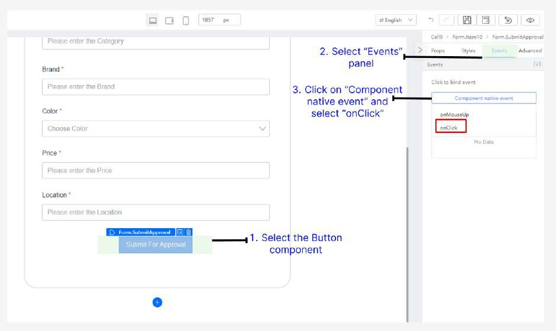

# Tutorial 19: Datasource API Binding

This tutorial covers the following Learning Objectives:

Understand how to bind datasources to APIs using HTTP GET and POST methods within a low-code platform.

Learn to handle and process various data types, datasources during API binding.

In this tutorial, you'll discover the Datasource API Binding feature of KAIZEN, which allows you to seamlessly connect and interact with external datasources. This feature enables you to bind APIs through GET and POST methods, retrieve and send data in diverse formats, and configure datasources to suit your application needs. By mastering these capabilities, you'll create dynamic and responsive applications that effectively manage data from multiple sources, enhancing their functionality and scalability.

## Practical 19.1: Binding API to Table (GET)

Binding an API to a frontend design enables seamless interaction between the user interface and backend services. This process allows developers to easily connect UI components to RESTful APIs, facilitating real-time data retrieval and manipulation with minimal coding. KAIZEN uses intuitive drag-and-drop interfaces, making it accessible for users with varying technical skills. This approach accelerates development, enhances maintainability, and allows teams to focus on business logic and user experience, leading to quicker deployment and improved application quality.

Navigate to the App Designer page by clicking on the Design icon

Go to Page1 Table page by clicking on the Resource panel

Click Preview  to enter the preview page, click Confirm using default roles

Explore the client-side feature (Searching, Sorting, Pagination)

Select Datasource and click Create

In the pop-up window, select getProducts and click Next

In the datasource configuration panel, click the V icon and select Expression

It will change the text box to javascript expression, allowing values to be evaluated dynamically

Ensure all other fields are changed to Expression

Enter the following details for the datasource configuration and click Create:

Locate the loadTable() function in Source Code Panel

Comment out Client-side code and Uncomment Server-side code and click Save

Shortcut key: Ctrl + /

Preview the page and observe Sorting, Searching and Pagination function are all server-side now

Inspect “Network tab” in developer tools to see that server side requests are

firing (F12)

## Practical 19.2: Binding API to Form submission (POST)

In this practical, you will learn how to handle form submissions using the Fetch API in JavaScript to send a POST request. This enables the collection of user input and send it to a server for processing, such as saving data to a database or initiating some backend logic.

Adding DataType & Datasource

In the API Designer, defining data types and individual query parameters serves distinct but complementary purposes in the development of a robust API. When you define a data type, you create a reusable structure that represents an object in your application, such as a product or user. This data type encapsulates multiple attributes (fields) and their types, forming a Value Object (VO) in Java. VOs help maintain a clear and consistent representation of complex data throughout the application. By leveraging data types, developers can:

Promote Reusability: Once defined, a data type can be utilized across multiple endpoints, reducing redundancy and enhancing maintainability.

Simplify Code: Using VOs simplifies method signatures and enhances code readability by allowing developers to work with well-defined objects rather than primitive types.

Firstly, in Service API designer, click on Add Data Type

Define the Data Type with the following details:

Name: ProductVO

Params:

Click Apply to create the Data Type

Next, select Add Datasource (+) under controller

Create a postProduct datasource with the following details:

Import Remaining APIs

In the Service Designer, click on ‘Import Service’ to import in the remaining 3 APIs

required for the BETraining application with the following file: kaizen-service(cleaned).xml

Binding to FormSubmission

Go back to the App Designer and navigate to the Page2 FormSubmission page

Select Datasource and click Create

In the pop-up window, select postProduct and click Next

In the datasource configuration panel, click the slash-icon (/) icon to change to javascript expression.

*Note: This configuration simplifies the process by reducing redundancy, as you can handle multiple values with a single expression, rather than configuring each parameter individually.

Enter the values:

Params: this.state.productForm

Click Create

Next, Bind Button component to onClick event

Select onSubmit and click Confirm

Make sure to publish these changes made and click Preview to enter the preview page (which will also automatically publish for you)

Open “Network tab” via developer tools to inspect the request being sent to server

The request payload name is set from the Form.Item Advanced property

Binding POST Form using “Encode”

To bypass security restrictions by converting special characters into a standardized format, form encoding allows data to be safely transmitted without triggering Web Application Firewall (WAF) rules. This ensures reliable communication with servers by preventing data from being blocked or misinterpreted.

Modify the ‘postProduct’ API with the following new change:

Encode Data: true

Request Headers: Content-Type:

Fire the request, observe the payload is automatically encoded

Recreate the Datasource by adding the headers application/json

Fire the request in preview, observe the payload is automatically encoded

