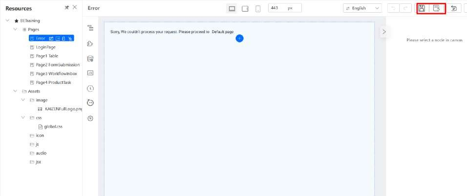

# Tutorial 20: Error Handling

This tutorial covers the following Learning Objectives:

Understand how to implement error handling mechanisms within the KAIZEN platform.

Learn how to manage and resolve common errors encountered during application development.

Improve application stability and user experience by effectively managing exceptions.

In this tutorial, you will explore error handling techniques within KAIZEN. By implementing robust error handling mechanisms, you will ensure that your application can gracefully handle and recover from errors, improving both the stability of the application and the overall user experience.

## Practical 20.1: Redirect to custom error page

Click on Edit Application

(Note) View the Error Pages configuration:

Forward Error: Error will be forwarded to page

To Error Page: Error will be redirected to error page

Navigate to the Error page, click on Save Draft and Publish Page

We will go through this error handling effect in a later tutorial on Code Generation to showcase how pages will be redirected to custom error pages.

