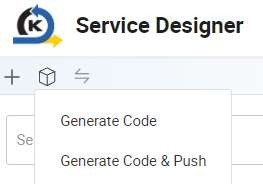
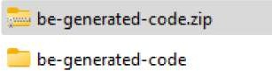
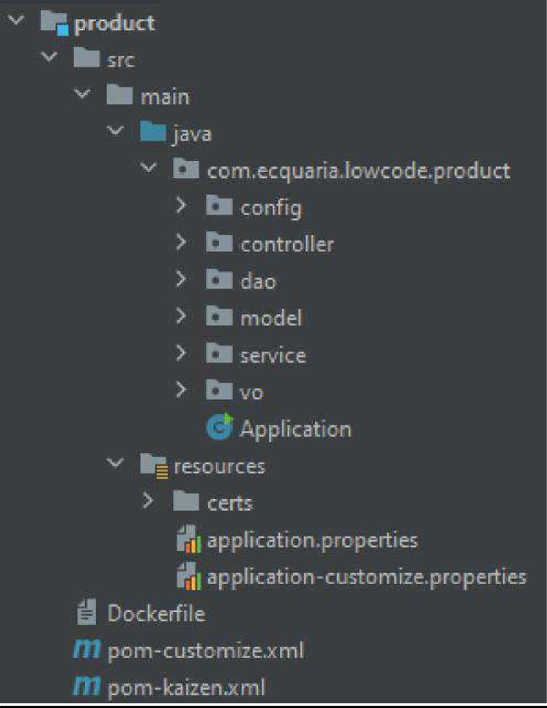
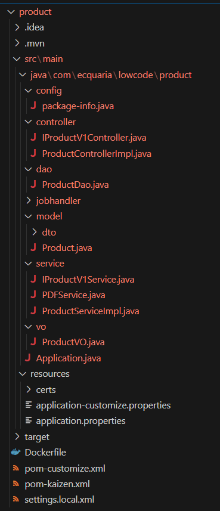

# Tutorial 22: Code Generation (Backend)

Generating backend code in KAIZEN simplifies the creation of robust server-side applications by converting user-defined configurations into structured Java code, including Value Objects (VOs) and application properties. This automated process enhances productivity by eliminating the need for manual coding, reducing the risk of errors, and ensuring adherence to best practices. Developers can easily integrate business logic, manage data access through DAOs, and configure application settings, all while maintaining a consistent architecture. By leveraging code generation tools, teams can accelerate backend development, streamline workflows, and focus on delivering high-quality applications efficiently.

## Practical 22.2: Generating and Running Backend Code

Generate Code

In Service Designer, select Generate Code

Ensure Backend: Product is selected together with the Generate service layer classes option, and click OK

A zip file is downloaded

Unzip the file

Understanding Generated Backend Code Structure

In KAIZEN, the backend code is often auto-generated to streamline development. However, understanding the structure of this generated code is crucial for customization, debugging, and integrating new features. The backend typically includes components like controllers, services, repositories, and models, each serving a specific role in handling API requests, business logic, and database interactions. By familiarizing yourself with this structure, you can make targeted modifications, optimize performance, and ensure the backend aligns with your application's requirements.

Directory Structure

The generated backend code in low-code platforms is organized into a clear directory structure to manage different functionalities efficiently. Common folders include:

Controllers: These handle incoming API requests and map interactions between the frontend and backend. Controllers can be customized to change specific API behaviors based on your application's needs.

Dao (Data access object): These are responsible for managing database interactions, using auto-generated methods to access and manipulate data. Repositories can be customized to add complex queries or optimize performance.

Models and Entities: Models represent your application's data and map directly to database tables. You can modify them to include additional fields or relationships, aligning with evolving business requirements.

Services: Services manage the core business logic and interact with controllers. They encapsulate reusable logic and can be extended or modified to introduce additional functionality.

Configuration: The configuration files in the generated backend code are essential for managing environment-specific settings like security, database connections, and API credentials

Download the zip file below containing the custom code and environment configurations to run your product service

product-custom.zip

This source code has the core business logic implemented which interacts with interfaces generated by KAIZEN.

Unzip and Copy the necessary code over.

For Windows:

Copy the product folder into the product folder of your generated code.

For macOS:

.mvn will be hidden, use command+shift+dot to show hidden files

$ rsync -av /source_folder/ /destination_folder/

The result will look something like below

Open your now updated generated code “Training<username>” in your IDE

Update the properties configuration in your application-customize.properties

file:

(\TrainingAmandaLam\product\src\main\resources) to your own schema name highlighted in red below

Spring.datasource.url: <username>_schema (Example: amandalam_schema)

Add the config property “spring.jpa.properties.hibernate.default_schema”

with the value as your username. See the area highlighted green below spring.jpa.properties.hibernate.default_schema: <username>_schema

(Example: spring.jpa.properties.hibernate.default_schema: amandalam_schema)

Open your terminal in the product directory (Training<username>/product)

mvn clean package -f pom-customize.xml

java -jar target/product.jar

