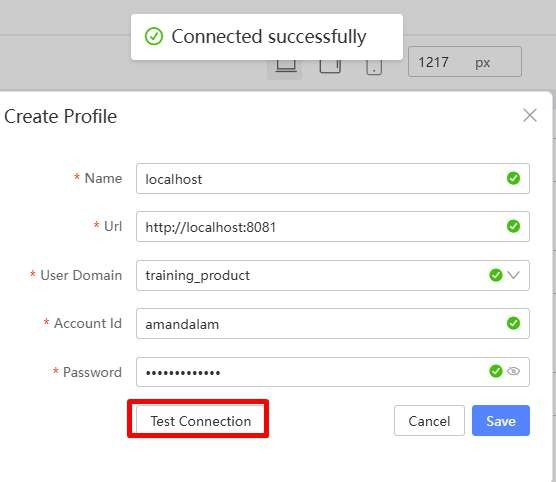
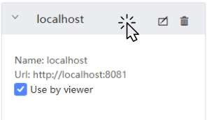
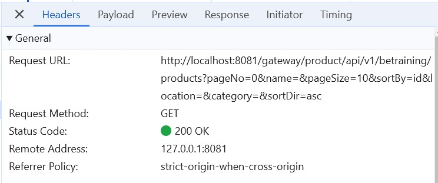

# Tutorial 23: Profile for local development

This tutorial covers the following Learning Objectives:

Learn how to configure profiles for local development within your application.

Understand how to redirect traffic to different resources based on the environment.

Improve local development workflows by integrating API calls with KAIZEN seamlessly.

In this tutorial, you will learn about configuring profiles that allow you to redirect traffic to different resources, enhancing local development. This feature enables smooth development of APIs in a local environment while still interacting with KAIZEN resources, improving the overall development experience.

Essentially, you can use profile to configure and connect to different environments, allowing you to easily access the APIs there from your frontend pages in the app designer. All these can be done without having to build and run your entire frontend application locally. Note that you can only connect to 1 profile at a time.

## Practical 23.1: Running be-services

For local development, the application requires running multiple services to simulate the production environment effectively. Developers need to run four jar files locally, each representing a critical component of the application. These jar files work together to provide the necessary backend functionality for testing, debugging, and developing features.

Download the following based on your Operating System:

If you are using Windows:

BETraining_JAR(CloudDaaSenv)-Windows.zip

Unzip the zip file. There should be a script file included (either a .sh for MacOS or Linux or .bat for Windows)

Open command prompt in the unzipped folder

Run the jar files through the script provided:

For Windows:

Run the script using ./start.bat

The script should open 5 terminal windows with the following KAIZEN microservices: IAM, Common, Console, Gateway, IAM Proxy:

Ensure that the applications run with no exceptions/stack traces. Alternatively, you can look out for the default Spring Boot Application started message (ie. Started Application in xx.xxx seconds (process running for xx.xxx))

## Practical 23.2: Update Profile feature

Click “Profiles” plugin

Add a new “localhost” profile

Click on Test Connection to test connectivity

Select “Use by viewer”. Selecting this feature will ensure that the application’s users with

external or internal viewer roles will use this profile when previewing the application.

Click to switch the profile

Click OK to reload the site

Ensure a Tick sign appears on the localhost profile

Refresh the page, note that API calls are made using your configured profile “localhost”,

which allows users to do local development.

Notice that all these data loaded on your application’s ‘Page1 Table’ page are taking the data

you have added in your schema earlier using the Database Designer Tutorial.

