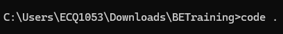
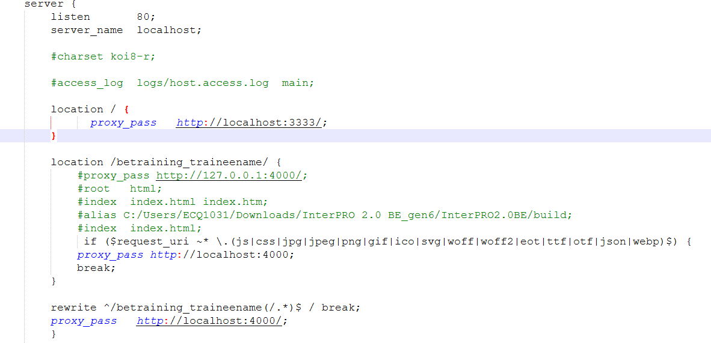

# Tutorial 25: Code Generation (Frontend)

This tutorial covers the following Learning Objectives:

Understand the process of code generation for both frontend and backend components using KAIZEN.

Gain insights into the structure and organization of the generated code to facilitate easier navigation and modifications.

Learn best practices for integrating and maintaining generated code within your development workflow to ensure consistency and scalability.

In this tutorial, you'll explore the code generation feature of KAIZEN, which allows you to automatically create frontend and backend code components tailored to your application. This feature streamlines the development process by eliminating repetitive coding tasks, enabling you to focus on business logic and functionality. You will also learn how to customize the generated code to align with your project’s architecture, ensuring a seamless integration with your existing codebase and improving overall maintainability.

## Practical 25.1: Generating and Running Frontend Code

Generating frontend code in KAIZEN streamlines the creation of interactive user interfaces by transforming user-defined JSON Schemas into functional React code. This automated process accelerates development, ensures consistency, and minimizes errors, allowing developers to focus on business logic and user experience rather than repetitive coding tasks. By using visual design tools and pre-defined templates, teams can quickly prototype, iterate, and deploy applications, making KAIZEN an effective solution for efficient software delivery.

Installation of Necessary Prerequisites:

Install Node.js (18.20.4) and Yarn to manage frontend dependencies.

Set up Nginx

Generate Code

Click setting and select Generate FE Code

A zip file is downloaded

Unzip the file

Open with your code editor or using command prompt

Visual Studio Code

Command Prompt

Ensure you’re using node version of 18.20.4

node -v

Change yarn registry path as some custom dependencies are hosted internally in Toppan network nexus

Install yarn (Skip this step if you’ve already installed yarn)

npm install -g yarn

yarn config set registry http://alb-kaizen-daasez-001-673358367.ap- southeast-1.elb.amazonaws.com:8081/repository/npm-group

Install the dependencies

yarn install

Run the application

yarn run start

Running nginx

Edit the nginx/nginx.conf value in the nginx folder to your username

betraining_traineename (Example: betraining_amandalam)

New nginx conf

For macOS:

Copy paste nginx.conf file inside /opt/homebrew/etc/nginx folder

Double click the nginx.exe to start the service. Some helpful command for debugging:

start nginx

nginx.exe -s stop

tasklist /FI "IMAGENAME eq nginx.exe"

For macOS:

sudo nginx

sudo nginx -s stop

Running the generated code

Navigate to http://localhost/betraining_traineename/#/loginpage, you should be able to see your login screen.

(Example: http://localhost/betraining_amandalam/#/loginpage)

After login to your account, you will be redirected and see the table listing

Triggering Error

Ctrl + C and stop the running of product.jar

Click on Download. As the API is no longer present, it will trigger a 500 error

Notice your page is redirected to error page

