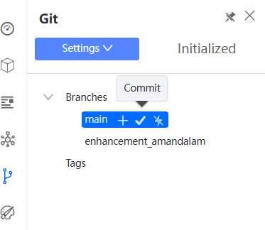

# Tutorial 26: Push and Merge Code to Git

This tutorial covers the following Learning Objectives:

Managing branches and tags within KAIZEN.

Learn to push changes to a Gitlab repository from KAIZEN for both frontend and backend code.

In earlier tutorials, we have learnt how to set up the connection to Git and switch to a new branch to work on various enhancements and test your application to run locally. Now, we’ll learn how to automate the process of committing and pushing changes in KAIZEN, thus improving efficiency and collaboration. We will demonstrate how the integration with GitLab’s CI/CD pipeline feature automates the testing and deployment, streamlining the release process directly from KAIZEN.

## Practical 26.1: Frontend Git Management

In KAIZEN, frontend Git branch management is essential for maintaining an organized and efficient workflow. By creating separate branches for UI changes, such as theme updates or new features, developers can isolate modifications, avoid conflicts, and ensure smooth collaboration across teams. This approach supports parallel development, minimizes disruption to the main codebase, and allows for better testing and integration of frontend updates, ultimately enhancing project quality and stability.

Once you enter the design page, you will be able to see the theme design button and the published theme.

Create New Tag and Git Push

On the App Designer, click on the commit icon of the branch you are on and proceed to commit changes, which will generate the FE code and push into Git.

When the branch is ready to be released, as you push your code to Git, you may also tag your commit to mark a specific commit as a release version (e.g., v1.0, v2.1.3) and is immutable.

You should be able to see this code changes pushed onto the branch on Git as well.

Another way to push FE Code onto the current branch on Git is from the project itself on the studio console by clicking Generate FE Code & Push.

Merge Code to Main Branch + Push Main Branch

Once you are done making relevant enhancements on your current enhancement branch, we will now proceed to merge your FE changes to the main branch.

Switch back to the main branch by clicking the Git branch on your application from the studio console.

In your app designer, click on the merge button beside the application and select your enhancement branch to merge into the main branch.

Before you merge, notice that the new additions will be highlighted in green. You will need to specify what you want to merge in by clicking on the blue arrows at each individual addition or on top to merge in all new additions.

In this case, the red colour coded indication indicates that there are changes to existing lines in the code. You may click into the file icon of each of the pages to view the

changes.

Click on the blue arrow on top to merge in all new changes made by the theme change.

After which, click on the ‘merge’ button.

You may now verify that your enhancements have been successfully merged and reflected on your application screens on the main branch.

Note that KAIZEN’s merge feature is not a replica of merging on Git. Refer to the

additional information below for more information on KAIZEN’s Git features.

Next, we will proceed to push these changes on the main branch onto Git. As done in the earlier step, click on the commit icon of the branch you are on and proceed to commit changes, which will generate the FE code and push into Git.

Once again, you may verify these code changes pushed onto the main branch on Git as well.

## Practical 26.2: Backend Git Management (Optional)

In KAIZEN, using Git branches for backend enhancements, such as adding a new API, is critical for maintaining clean, structured development workflows. By creating a separate branch for each enhancement, developers can work independently on new features without affecting the stability of the main application. This approach allows for safe testing, minimizes conflicts, and enables smoother collaboration among team members. Once the changes are tested and validated, the new API enhancements can be easily merged back into the main codebase, ensuring a stable and organized development process.

Create New Tag and Git Push

Earlier you have configured your respective service and controller in the Service Designer. Now we will proceed to generate the BE code and push these changes onto this new branch.

This will successfully push both the FE and BE code onto the specified branch on Git.

Similar to FE code push, notice that we can also create a tag for the BE code that we want to push to allow us to manage releases for features built.

Merge Code to Main Branch + Push Main Branch

Once you are done making relevant enhancements on your current enhancement branch, we will now proceed to merge your BE changes to the main branch as well. Switch back to the main branch.

Click on this merge button to merge into the main branch.

Select the new branch you pushed your code to earlier to merge into the main branch.

Before you merge, notice that the new additions will be highlighted in green. You will need to specify what you want to merge in by clicking on the blue arrows at each

individual addition or on top to merge in all new additions. After which, click on the

‘merge’ button.

Notice that your main branch on KAIZEN’s Service Designer now has the newly merged

new datasource from the enhancement branch.

Next, we will proceed to push these changes on the main branch onto Git. As done in the earlier step, click on the commit icon of the branch you are on and proceed to commit changes, which will generate the BE code and push into Git.

You may verify these code changes pushed onto the main branch on Git as well.

Additional Information - Branch Management

KAIZEN Merge Feature : For both frontend or backend development, KAIZEN’s merge feature is not a replica of merging on git. It solely handles the merging for the interfaces and code generated by KAIZEN (labelled in red). As for the custom logic in the service layer, it will be developed by the project team (labelled in green). Merging of code for the custom logic by the project should still be done through Git. KAIZEN only supports the pushing of code onto Git.

Branch Switching tied to individual users: Switching of branches on KAIZEN is a personal setting and is tied to individual users. Hence, if another project member switches branches, it will not be reflected on your application.

Separate FE and BE Branch Management: Backend branch switching operates independently from frontend branch management.

No Automatic Switching: Switching to a new branch on the frontend does not automatically switch the backend branch.

Resolve merge conflicts

When you work in a team, you may come across a situation when somebody pushes changes to a file you are currently working on. If these changes do not overlap (that is, changes were made to different lines of code), the conflicting

files can be accepted and merged straight away. However, if the same lines were affected, one side cannot randomly be picked over the other, and you will need to resolve the conflict.

Take the following scenario:

Dev 1 creates branch A from main

Dev 2 creates branch B from main

Dev 1 merges Branch A into main

Dev 2 now wants to merge Branch B into main. There is no pull function from main and we want to avoid changes being overwritten.

In this scenario, you may continue to merge Branch B into main and perform merge conflict resolution by accepting the additions or changes made in branch B.

For more information on the behaviour performing various actions in your application design on KAIZEN, refer to the Appendix below for User Actions in the App Designer (Frontend Development) and Service Designer (Backend Development).

Appendix

App Designer (Application Level)

Service Designer (Application Level)

