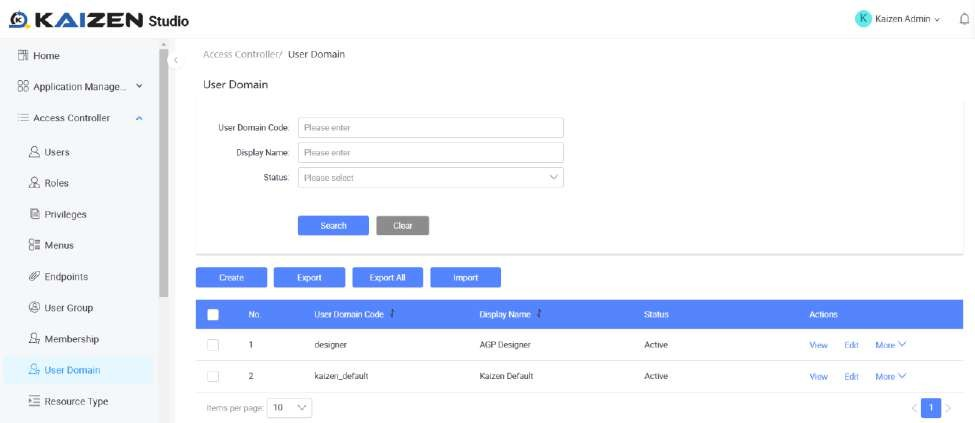
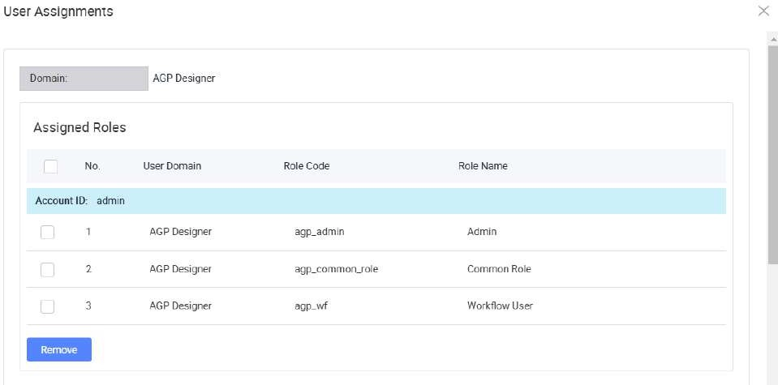
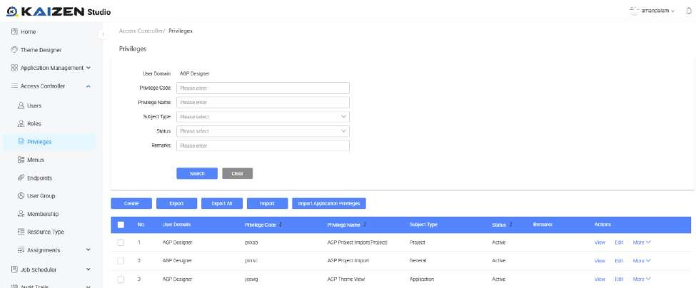
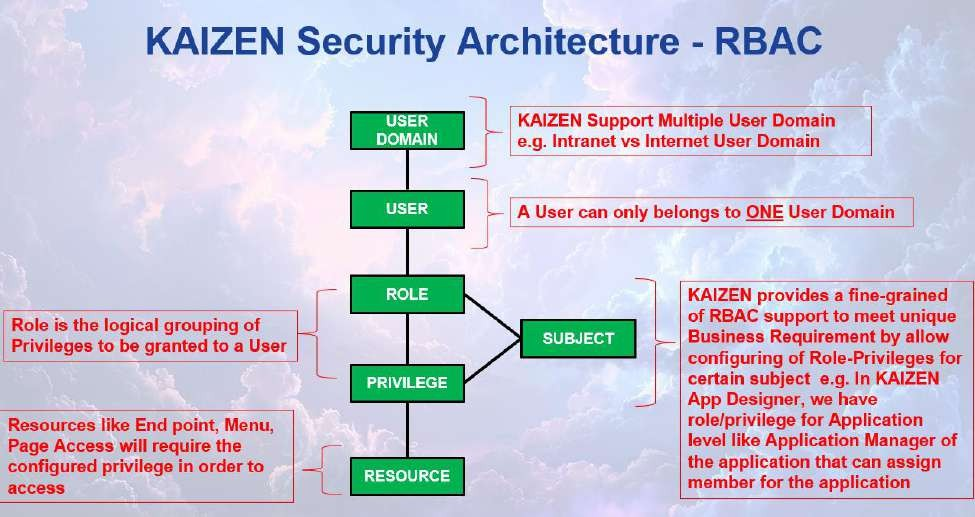
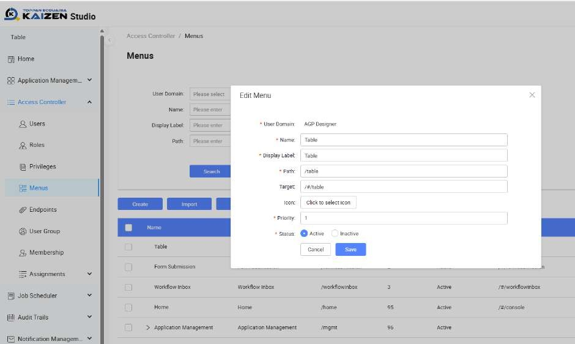
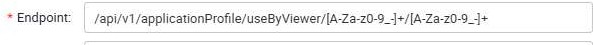
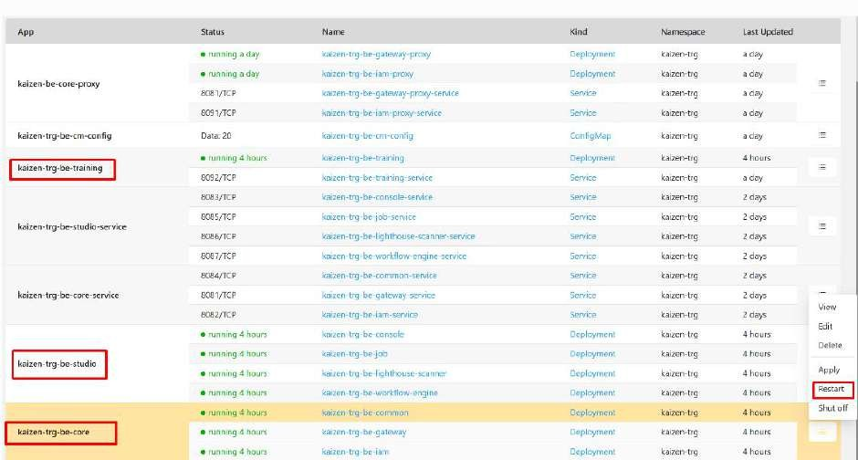

# Tutorial 28: IAM

This tutorial covers the following Learning Objectives:

Understand the concepts of IAM (Identity and Access Management) and Role-Based Access Control (RBAC).

Explore the relationships between user domains, users, roles, privileges, and endpoints.

Learn how to manage user roles, assign privileges, and secure access to endpoints in

an application’s domain environment.

In this tutorial, you will understand KAIZEN’s IAM system with RBAC, including defining user domains, assigning roles to users, configuring privileges, and managing access to endpoint resources securely and efficiently. This structure supports dynamic role and privilege assignments, allowing administrators to fine-tune access control. Privileges and resources ensure least-privilege access, aligning with security best practices. By leveraging this RBAC model, your application can provide efficient, scalable, and secure user access management tailored to organizational needs.

KAIZEN’s IAM features can be accessed here via the ‘Access Controller’ menu, which can be

accessed only if you have the admin role assigned to your user account.

Note that these are all actual runtime IAM features configurable for your application. In addition to this, KAIZEN also allows you to create your IAM configurations during the design phase of your application in the application level from the studio console.

You may access the admin user account in the Training Playground domain to access the IAM features.

URL: https://kaizen-training.toppanecquaria.com/#/login

User Domain: Training Playground

Username: admin

Password: Password$1234

Relationship: User domain ->* User ->* role ->* privileges ->* resources (API

endpoints/menu/page)

Example Flow

Currently there are 3 users in the "Sales" domain who are assigned to 3 roles:

“Manager”, "Editor" and "Viewer."

The Editor role has privileges to READ and UPDATE sales data endpoints.

The Viewer role has privileges to READ sales data endpoints.

The Manager gains combined access to CREATE,READ,UPDATE,DELETE sales data endpoints

User Domain

The User Domain acts as a boundary for user management and access control. It groups users, roles, privileges, and resources to enforce segregation of duties and multi-tenancy. Each domain defines its unique policies, ensuring users and roles within one domain do not conflict or overlap with those in another. For example, a project might have 2 applications, one being a customer facing portal (Internet) and the other being an internal staff portal (Intranet). In this case, the User Domain is introduced to maintain separation and enforce access control between the two user groups.

The user domain can only be accessed and configured by the ‘super admin’ role from the ‘Kaizen Default’ domain. You are also able to see this domain from KAIZEN’s login screen.

User

A User represents an individual entity with a unique identity within a specific domain.

Each user can belong to only one domain.

A user can be assigned one or more roles, depending on their responsibilities.

Users can inherit privileges indirectly through their assigned roles.

Role

A Role is a collection of privileges that represent a job function or responsibility within the domain.

Roles define what actions a user can perform by grouping privileges.

Users can have multiple roles, enabling flexible access control.

Roles are reusable and can be assigned to multiple users.

In a project scenario, our application offers some predefined roles that can be assigned to users, such as Project Manager, Developer, UI Designer, Internal Viewer, and External

Viewer. Each role is tailored with specific access levels, enabling precise control over features and functionalities for managing both applications and the overall project.

More information on Subject will be explained below.

Privileges

Privileges are granular permissions that define specific actions a role can perform on specific resources.

A role can have multiple privileges, specifying the allowed operations.

Privileges enforce fine-grained control over application features and functionalities.

Resources (Endpoints)

Resources refer to the endpoints or specific system assets that users can access. In our case, KAIZEN segregates access to various resources through endpoints.

Privileges are directly linked to resources, ensuring precise control over what each user or role can access.

Resources can include APIs, web pages, data objects, or any system element exposed through an endpoint.

Privileges define how resources are accessed, ensuring security and preventing unauthorized actions.

Subject adds a contextual layer to RBAC, by ensuring that roles and privileges apply only within a defined scope.

## Court Case Example: How "Subject" Works

We can use Subject to add RBAC control to the data level. In a Court Case Management system, we can use Subject to control the access rights for each court case.

Imagine a judicial system where different individuals take on roles such as Judges, Lawyers, and Clerks. Each role comes with specific privileges, but access to court cases should be restricted based on assignment.

Admin users may oversee case management but should not influence case outcomes.

Lawyers should only access the cases they are representing and file documents, but they cannot assign judges.

Judges should have full decision-making privileges over cases they are assigned to, but they cannot access or modify cases they are not involved in.

In this scenario, the court case itself acts as the Subject. A judge is not simply assigned a role, they are assigned a role in relation to a specific case.

## Practical Example: Judge Case Assignment

Consider Judge Alice and Judge Bob. They are both Judges, but their privileges are scoped to the cases they preside over.

Judge Alice is assigned with Judge role to Case #1001. She can review evidence, issue rulings, and set hearings for this case.

Judge Bob is assigned with Judge role to Case #1002. He has similar privileges but only within the context of his case.

Neither Judge Alice nor Judge Bob can interfere in each other's cases, even though both are Judges.

This fine-grained control is achieved by defining the court case as a Subject, ensuring that privileges are only valid within the assigned scope.

## Practical 28.1: Assignment of custom menu (Optional)

This tutorial covers the following Learning Objectives:

Learn how to assign custom menus and pages to your application.

Enhance navigation and user experience by providing tailored menus.

Understand how to structure your application to meet user needs more effectively.

In this tutorial, you will explore the process of assigning custom menus and pages to your application. This customization enables a personalized user experience, where navigation and page layout are adapted to meet the specific needs of your users or organization.

Create and Assign Menu

In the menu edit/create, you can fill in different fields such as name, label, path and target.

Menu also supports nested layer

Click on More > Assign

Users can assign custom privilege to allow only authorized users to view the menus

## Practical 28.2: Endpoint Assignment (Optional)

This tutorial covers the following Learning Objectives:

Understand how to assign endpoints to different functionalities within your application.

Learn how to organize and manage API endpoints efficiently.

Enhance application performance by structuring endpoints according to functional needs.

In this tutorial, you will learn how to assign and manage API endpoints for various functionalities within your application. Organizing endpoints ensures that each API is structured and accessible, making your backend services more efficient and easier to maintain.

Create new endpoint assignment

In the endpoint assignment page, click on “Create” button.

Endpoint also support regex expression

After creating endpoint, click on More > Assign

Users can also assign custom privilege to the endpoint to allow only authorized users to call the endpoint

Note:

For custom service to appear in the dropdown, it needs to be added to the

“service.names.mesh” property in application.properties file.

Example:

application.properties file

...

...

service.names.mesh: '{"iam":{"host":"kaizen-trg-be-iam-service.kaizen- trg.svc.cluster.local","port":8082,"contextPath":"/iam"},"console":{"host":"kaizen- trg-be-console-service.kaizen- trg.svc.cluster.local","port":8083,"contextPath":"/console"},"common":{"host":"kaizen- trg-be-common-service.kaizen- trg.svc.cluster.local","port":8084,"contextPath":"/common"},"job":{"host":"kaizen-trg- be-job-service.kaizen- trg.svc.cluster.local","port":8085,"contextPath":"/job"},"gateway":{"host":"kaizen- trg-be-gateway-service.kaizen- trg.svc.cluster.local","port":8081,"contextPath":""},"pagescan":{"host":"kaizen-trg- be-lighthouse-scanner-service.kaizen- trg.svc.cluster.local","port":8086,"contextPath":""},"workflow":{"host":"kaizen-trg- be-workflow-engine-service.kaizen- trg.svc.cluster.local","port":8087,"contextPath":"/workflow"},"setup":{"host":"kaizen- trg-be-setup-service.kaizen- trg.svc.cluster.local","port":8089,"contextPath":"/setup"},"betraining":{"host":"kaize n-trg-be-training-service.kaizen- trg.svc.cluster.local","port":8092,"contextPath":"/betraining"},"iamproxy":{"host":"ka izen-trg-be-iam-proxy-service.kaizen- trg.svc.cluster.local","port":8091,"contextPath":"/iamproxy"}}'

...

...

After editing Endpoint Assignment, backend deployment needs to be restarted for the change to take effect

